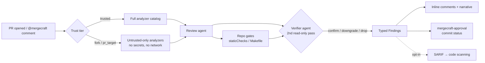
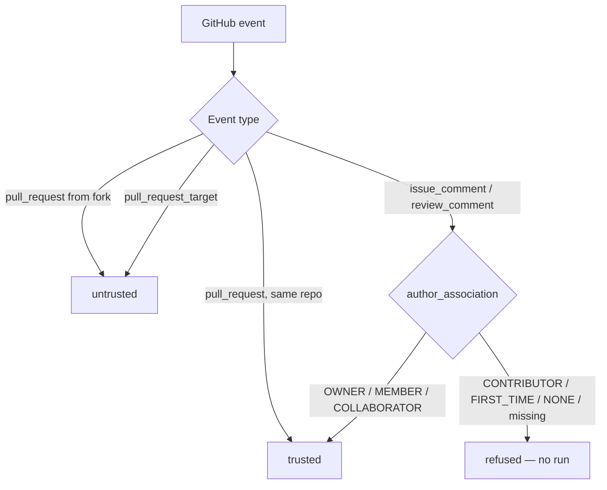

<!-- README-ideal.md — proposed README for alexhawat/mergeCraft.
     Asset placeholders (logo, demo gif, screenshots) live under docs/assets/. -->

<div align="center">

<!-- TODO: add docs/assets/logo.svg (light/dark variants) -->


# mergeCraft

**AI-powered PR review as a standalone, BYOK GitHub Action.**
No SaaS account. No dashboard. Your repo, your keys, your reviewers.

[](https://github.com/alexhawat/mergeCraft/actions/workflows/ci.yml)
[](https://github.com/alexhawat/mergeCraft/actions/workflows/codeql.yml)
[](https://github.com/alexhawat/mergeCraft/actions/workflows/docker.yml)
[](LICENSE)
[](pyproject.toml)
[](https://alexhawat.github.io/mergeCraft/)

<!-- TODO: add docs/assets/demo.gif — a 30s screen capture: open PR → @mergecraft review → inline findings → approval check -->


[Get started](#-get-started-in-3-steps) ·
[Features](#-features) ·
[Docs](https://alexhawat.github.io/mergeCraft/) ·
[Review checks](REVIEW-CHECKS.md) ·
[Contributing](CONTRIBUTING.md)

</div>

---

## Why mergeCraft?

Hosted AI reviewers (CodeRabbit et al.) want your code on their servers and a
per-seat subscription. mergeCraft is different:

- **BYOK** — bring your own Claude Pro/Max or ChatGPT subscription, or an API
  key. mergeCraft never talks to a proprietary backend; credentials and code
  stay inside GitHub Actions and this repo's code.
- **Evidence-first, not vibes-first** — deterministic analyzers and your repo's
  own gates settle mechanically checkable facts; the LLM only judges what's
  left, and a second read-only verifier re-reads every Critical/Major finding
  before it's published.
- **Fail-closed security** — untrusted contexts (fork PRs,
  `pull_request_target`, unknown commenters) degrade to a safe tier instead of
  running with secrets. Learnings memory is provenance-gated against prompt
  injection.
- **Zero lock-in** — one Docker action, one YAML workflow, MIT-licensed Python
  you can read end to end.

Inspired by [pullfrog](https://github.com/pullfrog/pullfrog) and CodeRabbit.

## ✨ Features

| | |
|---|---|
| 🔍 **Deep PR review** | Correctness, risk, blast-radius and hygiene lenses; inline findings + a short narrative verdict |
| 🧰 **Deterministic analyzers** | actionlint, zizmor, ShellCheck, Hadolint and more, auto-detected from changed paths — verified hits only, never guessed |
| ✅ **Structural approval gate** | `mergecraft-approval` commit status is a pure function of typed findings — the agent's own "approved" can never outvote a blocker |
| 🔁 **Model fallback chains** | Ordered `models:` list with per-slug `modelFallbacks:`; skips uncredentialed providers and retries past transient failures — `with: model:` becomes the chain head, not a kill-switch (see [Chain semantics](#chain-semantics--model)) |
| 🧠 **Provenance-gated memory** | `.mergecraft/learnings.md` persists cross-run knowledge; fork-authored entries are quarantined in `## Staging` until a maintainer promotes them |
| 🛡️ **Trust tiers** | Fork PRs and `pull_request_target` runs resolve to an untrusted tier: no secrets, no network, read-only analyzers |
| 📡 **SARIF upload (opt-in)** | Publish analyzer findings to GitHub code scanning with one flag |
| 📈 **Tracing (opt-in)** | Per-run span trees to local JSONL, Logfire, or any OTLP collector — with redaction |
| 💻 **Offline mode** | `mergecraft diff-review` reviews local diffs or patch files, no PR required — `--json` for benchmarks |
| 🧪 **Eval infrastructure** | Evidence packets, eval bank replay, and gate-and-bench scoring built in |

## 🏗️ How it works



<details>
<summary><b>Trust tiers & comment authorization</b> (click to expand)</summary>



The authorization decision reads `comment.author_association` from the event
payload — **never** the comment body — so writing `author_association: OWNER`
into a comment changes nothing. Details:
[Comment-trigger authorization](#comment-trigger-authorization).

</details>

## 🚀 Get started in 3 steps

> **Requirements:** Python 3.14+, [uv](https://docs.astral.sh/uv/),
> an authenticated [GitHub CLI](https://cli.github.com), and one provider
> credential.

**1. Install and scaffold** (in the repo you want reviewed):

```bash
uv tool install "git+https://github.com/alexhawat/mergeCraft@pre-0.0.1"
mergecraft init   # writes .mergecraft/config.yaml + .github/workflows/mergecraft.yml
```

**2. Authenticate** — use a subscription, no metered API billing:

```bash
mergecraft auth claude   # Claude Pro/Max
# or
mergecraft auth codex    # ChatGPT Plus/Pro/Team/Enterprise
```

The credential is saved as a GitHub Actions secret via `gh secret set`.

**3. Commit, push, and trigger** — open a PR, comment `@mergecraft review`, or
run the workflow manually. That's it: no server, dashboard, or account.

## 📖 Examples

### Example 1 — auto-review every PR

```yaml
# .github/workflows/mergecraft.yml
name: mergeCraft
on:
  pull_request:
  workflow_dispatch:

permissions:
  contents: write
  pull-requests: write
  issues: write
  id-token: write

jobs:
  review:
    runs-on: ubuntu-latest
    steps:
      - uses: actions/checkout@v5
      - uses: alexhawat/mergeCraft@pre-0.0.1
        env:
          CLAUDE_CODE_OAUTH_TOKEN: ${{ secrets.CLAUDE_CODE_OAUTH_TOKEN }}
```

### Example 2 — hardened, review as a required check

When the review gates merges, use `pull_request_target` with trust-aware
restrictions — [`examples/workflows/mergecraft-hardened.yml`](examples/workflows/mergecraft-hardened.yml)
ships wait-for-CI, same-repo guards, and an enforce step that flips a `neutral`
approval check to blocking.

### Example 3 — local review before you push

```bash
mergecraft diff-review                                   # uncommitted + branch changes vs origin/main
mergecraft diff-review --diff changes.patch --dry-run    # inspect the prompt, no LLM call
mergecraft diff-review --json findings.json              # machine-readable Finding[] for scoring
```

### Example 4 — multi-model with fallback

```yaml
# .mergecraft/config.yaml
models:
  - anthropic/claude-sonnet
  - openai/gpt-5.3-codex
  - google/gemini-3.1-pro-preview
modelFallbacks:
  anthropic/claude-sonnet:
    - anthropic/claude-opus
push: restricted
shell: restricted
staticChecks:
  - name: lint
    command: make lint
```

Add `model: <slug>` to the workflow `with:` block to pick the **head** of
the chain (default chain head is the first `models:` entry); the configured
fallbacks are walked on credential miss or retryable failure. See
[Chain semantics](#chain-semantics--model-37--w4) for the contract.

### Example 5 — SARIF upload to code scanning (opt-in)

Publish analyzer findings as GitHub code-scanning alerts — off by default,
requires `security-events: write`:

```yaml
permissions:
  contents: read
  pull-requests: write
  security-events: write   # required — without it GitHub answers 403

jobs:
  review:
    steps:
      - uses: alexhawat/mergeCraft@pre-0.0.1
        with:
          sarif_upload: enabled
```

Only findings admitted by the run's trust tier, `shell:` policy and
`analyzers:` mode are uploaded, after secret redaction — agent narrative is
never uploaded. Details: [docs/ANALYZERS.md](docs/ANALYZERS.md).

Full config reference: [`examples/config.yaml`](examples/config.yaml).

## 🔑 Authentication

| Provider | Subscription (recommended) | API key |
|----------|-----------------------------|---------|
| Anthropic Claude | `mergecraft auth claude` → `CLAUDE_CODE_OAUTH_TOKEN` (Claude Pro/Max) | `ANTHROPIC_API_KEY` |
| OpenAI Codex | `mergecraft auth codex` → `CODEX_AUTH_JSON` (ChatGPT Plus/Pro/Team/Enterprise) | `OPENAI_API_KEY` |
| Google Gemini | `mergecraft auth gemini` → `GEMINI_API_KEY` (AI Studio) | `GEMINI_API_KEY` / `GOOGLE_GENERATIVE_AI_API_KEY` |
| Nous Portal | — (API key) | `mergecraft auth nous` → `NOUS_API_KEY` (`nous/deepseek/deepseek-v4-flash`) |
| Tencent TokenHub | — (API key) | `mergecraft auth tokenhub` → `TOKENHUB_API_KEY` (`tokenhub/hy3` + any TokenHub model) |
| Cursor Cloud | `mergecraft auth cursor` → `CURSOR_API_KEY` | `CURSOR_API_KEY` |
| Logfire tracing | `mergecraft auth logfire` → `MERGECRAFT_LOGFIRE_TOKEN` + `MERGECRAFT_TRACING_PROJECT` (local) and `LOGFIRE_TOKEN` (Actions) | see [`docs/TRACING.md`](docs/TRACING.md) |

Subscription auth runs the official `claude` / `codex` / `gemini` CLIs as *you*
— the same credential your local coding agent uses. Only set env vars for
providers you actually use.

> **Codex on container runners:** Codex CLI's nested bubblewrap sandbox fails
> inside namespaced containers. On an already-isolated ephemeral runner, pass
> `codex_sandbox: danger-full-access`. mergeCraft never sets this itself —
> its own `shell`/`push` controls remain the security boundary
> ([issue #70](https://github.com/alexhawat/mergeCraft/issues/70)).

### Custom OpenAI-compatible provider

For any OpenAI-compatible endpoint (Nous Portal, Tencent TokenHub,
MiniMax, OpenRouter, a self-hosted vLLM, etc.), mergeCraft exposes one
mechanism that both harnesses consume. Issue
[#71](https://github.com/alexhawat/mergeCraft/issues/71) closes on this
surface — the **Codex half** is new in `v0.0.x`; the OpenCode half
shipped earlier in PR
[#79](https://github.com/alexhawat/mergeCraft/pull/79) and is
regression-tested.

#### Env-var convention

| Form | Example | Provider id |
|------|---------|-------------|
| Singleton back-compat alias (PR #79 / D7) | `MERGECRAFT_CUSTOM_PROVIDER_BASE_URL` + `MERGECRAFT_CUSTOM_PROVIDER_API_KEY` | `default` (or the active model's prefix when the model is `nous/...` or `tokenhub/...`) |
| Indexed multi-provider | `MERGECRAFT_CUSTOM_PROVIDER_BASE_URL_1` + `MERGECRAFT_CUSTOM_PROVIDER_API_KEY_1`, `_2`, `_3`, … | `provider_1`, `provider_2`, `provider_3`, … |

Indexed env vars are operator-locked — both halves of each numeric pair
must be set with non-empty values; partial pairs are silently dropped.
Discovery enumerates every matching suffix, sorts by numeric `N`
ascending, and preserves gaps (no renumbering). When any indexed pair is
set, the singleton is ignored.

#### Action inputs (`with:`)

For the common single-provider case, two top-level `with:` inputs map
onto the singleton env vars — no need to name them in `env:`:

```yaml
- uses: alexhawat/mergeCraft@pre-0.0.1
  with:
    model: default/your-model-id
    provider_base_url: https://api.example.com/v1
    provider_api_key_env: MY_PROVIDER_API_KEY   # the NAME of an env var, not the key value
  env:
    MY_PROVIDER_API_KEY: ${{ secrets.MY_PROVIDER_API_KEY }}  # wire the secret here
```

`provider_api_key_env` is the **env-var name** that holds the key;
mergeCraft reads that env var's value and re-exports it as
`MERGECRAFT_CUSTOM_PROVIDER_API_KEY`. The resolved key value is never
inlined into the workflow file and never logged (convention 7). For
multi-provider setups, fall back to the indexed env-var form below —
`with:` cannot enumerate multiple providers.

#### Worked example — Nous-hosted DeepSeek V4 Flash

A raw pass-through slug reaches Nous's OpenAI-compatible endpoint via
either harness:

```yaml
- uses: alexhawat/mergeCraft@pre-0.0.1
  with:
    model: nous/deepseek/deepseek-v4-flash  # raw pass-through slug
  env:
    NOUS_API_KEY: ${{ secrets.NOUS_API_KEY }}      # preset path — no MERGECRAFT_* needed
```

The model prefix `nous` resolves against `NOUS_API_KEY` (set above) and
`https://inference-api.nousresearch.com/v1`. The harness then registers
the provider, sets `enabled_providers = ["nous"]`, and serves the model.

#### Multi-provider — Codex-side indexed pairs

Two distinct OpenAI-compatible providers in one workflow (e.g. MiniMax
and Nous alongside OpenAI):

```yaml
- uses: alexhawat/mergeCraft@pre-0.0.1
  with:
    model: provider_1/deepseek-v4-flash           # active provider_1
  env:
    MERGECRAFT_CUSTOM_PROVIDER_BASE_URL_1: https://inference-api.nousresearch.com/v1
    MERGECRAFT_CUSTOM_PROVIDER_API_KEY_1:  ${{ secrets.NOUS_API_KEY }}
    MERGECRAFT_CUSTOM_PROVIDER_BASE_URL_2: https://api.MiniMax.io/v1
    MERGECRAFT_CUSTOM_PROVIDER_API_KEY_2:  ${{ secrets.MINIMAX_API_KEY }}
```

Codex writes the corresponding `config.toml`:

```toml
[model_providers.provider_1]
name = "provider_1"
base_url = "https://inference-api.nousresearch.com/v1"
env_key = "MERGECRAFT_CUSTOM_PROVIDER_API_KEY_1"
wire_api = "responses"

[model_providers.provider_2]
name = "provider_2"
base_url = "https://api.MiniMax.io/v1"
env_key = "MERGECRAFT_CUSTOM_PROVIDER_API_KEY_2"
wire_api = "responses"
```

The `env_key` field references the **env-var name**, not the resolved
key value — convention 7. The harness reads the env var at exec time.

#### Which harness handles which

| Harness | Format written | Where it lives |
|---------|----------------|----------------|
| OpenCode | `provider.<id>.options.baseURL` / `.apiKey` (JSON) | `OPENCODE_CONFIG_CONTENT` (inline) and `OPENCODE_CONFIG` (file) |
| Codex CLI 0.146 | `[model_providers.<id>]` with `base_url` / `env_key` / `wire_api = "responses"` (TOML) | `$CODEX_HOME/config.toml` |

Both harnesses consume the same shared resolver
(`src/mergecraft/agents/openai_compatible_gateways.py`), so the env-var
contract is one — pass-through slugs (`<provider>/<model>`) route to
the right harness via the existing chain logic. OpenAI-compatible
models route to the OpenCode harness (no first-party Codex provider);
"true" OpenAI models route to Codex.

> PR [#79](https://github.com/alexhawat/mergeCraft/pull/79) shipped the
> OpenCode side of this feature; the Codex side, the `with:` input
> surface, and the env-var multi-provider extension all land together in
> this release — see issue
> [#71](https://github.com/alexhawat/mergeCraft/issues/71).

### Chain semantics — `model:` (#37 / W4)

The `with: model:` input is the **chain head**, not a chain kill-switch.
The configured `models:` / `modelFallbacks:` tail is preserved and walked
on credential miss or retryable failure. Issue
[#37](https://github.com/alexhawat/mergeCraft/issues/37) closes on this.

```yaml
# .mergecraft/config.yaml — the configured chain
models:
  - anthropic/claude-sonnet
  - openai/gpt-5.3-codex
  - google/gemini-3.1-pro-preview
modelFallbacks:
  anthropic/claude-sonnet:
    - anthropic/claude-opus
```

```yaml
# .github/workflows/mergecraft.yml — a single ``uses:`` step walks the
# chain. ``model:`` is the head; the configured tail follows.
- uses: alexhawat/mergeCraft@pre-0.0.1
  with:
    model: anthropic/claude-sonnet        # ← chain head (your pick)
    # model_pin: enabled                 # ← uncomment to collapse to one model
  env:
    ANTHROPIC_API_KEY: ${{ secrets.ANTHROPIC_API_KEY }}
    OPENAI_API_KEY: ${{ secrets.OPENAI_API_KEY }}
    GEMINI_API_KEY: ${{ secrets.GEMINI_API_KEY }}
```

Effective chain in the example above (with the operator-named head
preserved as the first entry):

```text
[anthropic/claude-sonnet, anthropic/claude-opus,
 openai/gpt-5.3-codex, google/gemini-3.1-pro-preview]
```

`MERGECRAFT_MODEL` (env var) follows the same rule: it joins as the head.

#### Escape hatch — `model_pin: enabled`

To restore the legacy "use exactly this model, suppress fallbacks"
semantics, set `model_pin: enabled` on the `with:` block, or
`modelPin: true` in `.mergecraft/config.yaml` (the action input wins):

```yaml
- uses: alexhawat/mergeCraft@pre-0.0.1
  with:
    model: anthropic/claude-sonnet
    model_pin: enabled                 # ← chain collapses to [claude-sonnet]
```

#### Action parity with `models:`

`models:` is the chain, `model:` is the head. `models:` alone (without
`with: model:`) is supported and unchanged — the chain runs as configured.
A workflow that used to dual-step (`if: HAS_CLAUDE` → one review, else
`if: HAS_OPENAI` → another) collapses to a single step.

## 🧰 CLI

| Command | Purpose |
|---------|---------|
| `mergecraft init` | Scaffold `.mergecraft/config.yaml` + example workflow |
| `mergecraft auth <provider>` | Save a credential via `gh secret set` (`claude`, `codex`, `gemini`, `nous`, `tokenhub`, `cursor`, `logfire`) |
| `mergecraft models list / set / show` | Curated slugs, ordered preference list, effective winner |
| `mergecraft diff-review` | Offline local git/patch review (`--dry-run`, `--json`) |
| `mergecraft watch --pr N` | Stream PR/issue timeline as JSONL |
| `mergecraft learnings active / staging / influence` | Audit memory entries and their provenance |
| `mergecraft traces <run-id>` | Read back local tracing spans (re-redacted) |
| `mergecraft config tracing` | Render resolved tracing state (token redacted) |
| `mergecraft gha` | Action runtime entry (Docker action) |

## 🔒 Security model

- **BYOK by design** — credentials and repo content never leave GitHub
  Actions / your machine and this repo's code.
- **Comment triggers are authorized, not authenticated-by-content** — only
  `OWNER`/`MEMBER`/`COLLABORATOR` associations can invoke; the body is never
  consulted. Two opt-in knobs (`allow_pr_target_comments`,
  `commentInvocationAllowlist`) each widen exactly one axis.
- **Learnings are fail-closed** — entries land in `## Staging`; only
  maintainer-associated authors promote to `## Active`, and active entries are
  nonce-fenced before the model reads them.
- **The approval check is structural** — `success` requires a completed trusted
  run with no Critical/Major findings; `failure` on any blocker; `neutral` for
  crashes, timeouts, and untrusted tiers. The agent's narrative approval is
  advisory only.
- **Analyzers under low trust run untrusted-only** — no secrets, no network, no
  PR-authored command construction; exclusions are reported as named skips.

Report vulnerabilities via [SECURITY.md](SECURITY.md). What a review does and
never does: [REVIEW-CHECKS.md](REVIEW-CHECKS.md).

## ⚙️ Workflow-placement gotchas (`pull_request_target`)

Under GitHub's Nov 2025 policy (effective 2025-12-08), `pull_request_target`
workflows resolve from the **default branch** — so a PR that edits the workflow
cannot review itself, and a copy on a non-default trunk is inert. If the review
is **not** a required check, prefer plain `pull_request`. If you pin the action
SHA in several places, gate them in CI — and read the workflow side from the
default branch (`git show origin/main:.github/workflows/mergecraft.yml`).
Full rationale in the collapsible sections of
[docs](https://alexhawat.github.io/mergeCraft/).

## 📚 Documentation

| Doc | What it covers |
|-----|----------------|
| [REVIEW-CHECKS.md](REVIEW-CHECKS.md) | Every check a review applies — lenses, gates, grading, what it never reports |
| [docs/ANALYZERS.md](docs/ANALYZERS.md) | Analyzer catalog, trust tiers, SARIF upload |
| [docs/TRACING.md](docs/TRACING.md) | Opt-in span trees: JSONL, Logfire, OTLP |
| [docs/REVIEW-DOCTRINE.md](docs/REVIEW-DOCTRINE.md) | Why mergeCraft makes the calls it makes |
| [docs/evidence-packet.md](docs/evidence-packet.md) | Typed findings & merge evidence |
| [docs/eval-bank.md](docs/eval-bank.md) | Eval replay and bench scoring |
| [CONTRIBUTING.md](CONTRIBUTING.md) | Contributor workflow (`make setup / lint / typecheck / test / ci`) |

## 🗺️ Roadmap

- [ ] PyPI release (`pip install merge-craft`)
- [ ] GitHub Marketplace listing
- [ ] Cursor local CLI harness (issue #13 Phase B)
- [ ] Expanded analyzer catalog (opt-in long tail)
- [ ] Published eval benchmarks

## Development

```bash
make setup      # uv sync + pre-commit
make lint       # ruff
make typecheck  # mypy strict
make test       # pytest
make ci         # full gate
```

Style and CI patterns adapted from
[sevn-bot/sevn@pre-0.0.1](https://github.com/sevn-bot/sevn/tree/pre-0.0.1).

## License

MIT — see [LICENSE](LICENSE) and [NOTICE](NOTICE).
