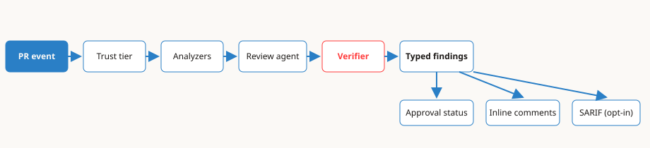

<div align="center">

<picture>
  <source media="(prefers-color-scheme: dark)" srcset="assets/brand/mark-dark.svg">
  
</picture>

# mergeCraft

**AI-powered PR review as a standalone, BYOK GitHub Action.**
No SaaS account. No dashboard. Your repo, your keys, your reviewers.

[](https://github.com/alexhawat/mergeCraft/actions/workflows/ci.yml)
[](https://github.com/alexhawat/mergeCraft/actions/workflows/codeql.yml)
[](https://github.com/alexhawat/mergeCraft/actions/workflows/docker.yml)
[](LICENSE)
[](pyproject.toml)
[](skills/mergecraft/SKILL.md)
[](llms.txt)

[Problem](#problem) ·
[How it works](#how-it-works) ·
[Demo](#demo) ·
[Install](#install) ·
[For agents](#for-agents) ·
[Features](#features) ·
[Docs](#docs)

</div>

---

## Problem

Three reasons teams pick mergeCraft over hosted reviewers:

### Hosted SaaS → BYOK

Bring your own Claude Pro/Max or ChatGPT subscription, or an API key. Credentials
and code stay inside GitHub Actions and this repo's code — no proprietary backend.

### Vibes → evidence + verifier

Deterministic analyzers settle mechanically checkable facts; the LLM only judges
what is left, and a second read-only verifier re-reads every Critical/Major
finding before it is published.

### Lock-in → MIT Action

One Docker action, one YAML workflow, MIT-licensed Python you can read end to end.
Inspired by [pullfrog](https://github.com/pullfrog/pullfrog) and CodeRabbit.

## How it works

<picture>
  <source media="(prefers-color-scheme: dark)" srcset="assets/diagrams/pipeline-dark.svg">
  
</picture>

A pull request event resolves a **trust tier**, runs the matching **analyzers**,
then a **review agent** and a read-only **verifier** produce **typed findings**
that drive inline comments, the `mergecraft-approval` check, and optional SARIF
upload. Trust-tier details and advanced workflow patterns live in
[`docs/workflows.md`](docs/workflows.md).

## Demo

Demo capture pending — see [`docs/assets/README.md`](docs/assets/README.md) for
the operator-owned GIF path. No placeholder image ships until a real capture exists.

## Install

> **Requirements:** **Python 3.11+**, [uv](https://docs.astral.sh/uv/), an
> authenticated [GitHub CLI](https://cli.github.com), and one provider credential.
> Full install paths: [`docs/install.md`](docs/install.md).

1. **Add the GitHub Action** — pin to an immutable ref (commit SHA until the first
   release tag exists):

```yaml
# .github/workflows/mergecraft.yml (minimal — see Example 1 below)
- uses: alexhawat/mergeCraft@507ec34966fa4a1c82046b8316863ae59dc5f539
  env:
    CLAUDE_CODE_OAUTH_TOKEN: ${{ secrets.CLAUDE_CODE_OAUTH_TOKEN }}
```

Or scaffold with the CLI:

```bash
uv tool install "merge-craft @ git+https://github.com/alexhawat/mergeCraft"
mergecraft init   # writes .mergecraft/config.yaml + .github/workflows/mergecraft.yml
```

2. **Authenticate** a provider (subscription recommended — no metered API billing):

```bash
mergecraft auth claude   # Claude Pro/Max
# or
mergecraft auth codex    # ChatGPT Plus/Pro/Team/Enterprise
```

The credential is saved as a GitHub Actions secret via `gh secret set`.
More providers: [`docs/authentication.md`](docs/authentication.md).

3. **Trigger a review** — open a pull request, comment `@mergecraft review`, or
   run the workflow via `workflow_dispatch`.

### Example 1 — auto-review every PR

```yaml
# .github/workflows/mergecraft.yml
name: mergeCraft
on:
  pull_request:
  workflow_dispatch:

permissions:
  contents: write
  pull-requests: write
  issues: write
  id-token: write

jobs:
  review:
    runs-on: ubuntu-latest
    steps:
      - uses: actions/checkout@v5
      - uses: alexhawat/mergeCraft@507ec34966fa4a1c82046b8316863ae59dc5f539
        env:
          CLAUDE_CODE_OAUTH_TOKEN: ${{ secrets.CLAUDE_CODE_OAUTH_TOKEN }}
```

> Pin to a full commit SHA (as above) or a git tag once one exists — never a tag
> that is not in the repository. To verify a published image's Cosign signature,
> see [CONTRIBUTING.md § Verify a published image](CONTRIBUTING.md#verify-a-published-image).

<span id="for-agents"></span>

## For AI coding agents

mergeCraft is designed to be installed and operated **by an agent, from a
prompt**. Point your agent at this repo and paste one of the prompts below.

### One-line setup prompts (copy/paste into your agent)

**Claude Code / Copilot CLI / Gemini CLI / any shell-capable agent:**

> Set up mergeCraft PR review in this repository. Follow
> https://github.com/alexhawat/mergeCraft#install. Steps: (1) ensure Python
> 3.11+ and uv are installed; (2) run
> `uv tool install "merge-craft @ git+https://github.com/alexhawat/mergeCraft"`;
> (3) run `mergecraft init`; (4) run `mergecraft auth claude` (or
> `mergecraft auth codex` — ask me which provider); (5) commit the generated
> `.mergecraft/config.yaml` and `.github/workflows/mergecraft.yml` on a new
> branch and open a PR. Do not commit secrets. Stop and ask me before any
> step that needs interactive authentication.

**Cursor (chat / composer):**

> Read [`AGENTS.md`](AGENTS.md) and set up mergeCraft in this repo: install the
> CLI with uv (`uv tool install "merge-craft @ git+https://github.com/alexhawat/mergeCraft"`),
> run `mergecraft init`, then generate the workflow and config. Leave the
> `mergecraft auth` step to me — print the exact command I should run.

**ChatGPT (Codex / cloud agent):**

> Task: make this repo use mergeCraft for AI PR review. Create a branch that
> adds `.github/workflows/mergecraft.yml` (use [Example 1](#example-1--auto-review-every-pr)
> — pin `uses: alexhawat/mergeCraft@…` to a full commit SHA or an existing git tag,
> with `CLAUDE_CODE_OAUTH_TOKEN` from secrets) and a default
> `.mergecraft/config.yaml`. Open a PR. I will add the secret myself.

### What the agent will need from you

- **One credential** — either a Claude Pro/Max or ChatGPT subscription login
  (via `mergecraft auth claude` / `mergecraft auth codex`, interactive), or an
  API key set as a GitHub secret. The agent cannot do the interactive login
  for you; a good agent will stop and hand that step back.
- **An authenticated `gh` CLI** if the agent should store the secret for you
  (`gh secret set`). Otherwise it will print the secret name to add in the
  GitHub UI.

### Install mergeCraft as a skill in your agent

If your agent supports skills (Claude Code, Copilot CLI, and other
Agent-Skills-compatible tools), install the mergeCraft skill so the agent
knows mergeCraft's commands, config keys, and failure modes:

```bash
# Claude Code / Copilot CLI (project-scoped)
mkdir -p .claude/skills
git clone --depth 1 https://github.com/alexhawat/mergeCraft /tmp/mergecraft
cp -r /tmp/mergecraft/skills/mergecraft .claude/skills/mergecraft
```

Or with a skills-aware installer (example):

```bash
npx skills add alexhawat/mergeCraft --skill mergecraft
```

Or install the **Claude plugin** (skill + commands, one step):

```bash
# Inside Claude Code:
/plugin marketplace add alexhawat/mergeCraft
/plugin install mergecraft@mergecraft
```

Once installed, prompts like *"review my local diff with mergeCraft"* or
*"why did the mergeCraft check fail on this PR?"* work out of the box. Local
review uses **`mergecraft review`** ([`docs/cli.md`](docs/cli.md)).

Curated doc map for LLMs: [`llms.txt`](llms.txt) · full agent guidance:
[`AGENTS.md`](AGENTS.md) · skill: [`skills/mergecraft/SKILL.md`](skills/mergecraft/SKILL.md)

## Features

| | |
|---|---|
| 🔍 **Deep PR review** | Correctness, risk, blast-radius and hygiene lenses; inline findings + narrative verdict |
| 🧰 **Deterministic analyzers** | actionlint, zizmor, ShellCheck, Hadolint and more — verified hits only |
| ✅ **Structural approval gate** | `mergecraft-approval` is a pure function of typed findings |
| 🔁 **Model fallback chains** | Ordered `models:` with per-slug fallbacks — see [`docs/authentication.md`](docs/authentication.md#chain-semantics--model-37--w4) |
| 🛡️ **Trust tiers** | Fork PRs and `pull_request_target` degrade to untrusted: no secrets, read-only analyzers |
| 📡 **SARIF upload (opt-in)** | Publish analyzer findings to GitHub code scanning |
| 📈 **Tracing (opt-in)** | Span trees to JSONL, Logfire, or OTLP — [`docs/TRACING.md`](docs/TRACING.md) |
| 💻 **Offline mode** | `mergecraft review` on local diffs, worktrees, or cloned repos |

**Terminal verdict (default: enforce).** A run without a validated
`submit_review_verdict` reports `inconclusive`. Set `gates.terminal_verdict: shadow`
in `.mergecraft/config.yaml` to log diagnostics only.

## Authentication

| Provider | Subscription (recommended) | API key |
|----------|-----------------------------|---------|
| Anthropic Claude | `mergecraft auth claude` → `CLAUDE_CODE_OAUTH_TOKEN` | `ANTHROPIC_API_KEY` |
| OpenAI Codex | `mergecraft auth codex` → `CODEX_AUTH_JSON` | `OPENAI_API_KEY` |
| Google Gemini | `mergecraft auth gemini` → `GEMINI_API_KEY` | `GEMINI_API_KEY` |
| Nous Portal | — | `mergecraft auth nous` → `NOUS_API_KEY` |
| Tencent TokenHub | — | `mergecraft auth tokenhub` → `TOKENHUB_API_KEY` |
| MiniMax | — | `mergecraft auth minimax` → `MERGECRAFT_CUSTOM_PROVIDER_API_KEY` |
| Cursor Cloud | `mergecraft auth cursor` → `CURSOR_API_KEY` | `CURSOR_API_KEY` |
| Logfire tracing | `mergecraft auth logfire` | see [`docs/TRACING.md`](docs/TRACING.md) |

Custom OpenAI-compatible endpoints, multi-provider indexed env vars, and
`model:` chain semantics: [`docs/authentication.md`](docs/authentication.md).

## Docs

| Doc | What it covers |
|-----|----------------|
| [`docs/install.md`](docs/install.md) | Python 3.11+ floor, Action vs CLI install, Docker fallback |
| [`docs/authentication.md`](docs/authentication.md) | Providers, custom gateways, model fallback chains |
| [`docs/workflows.md`](docs/workflows.md) | Examples 2–6, trust tiers, `pull_request_target` gotchas |
| [`docs/cli.md`](docs/cli.md) | Full `mergecraft` command reference |
| [`docs/action-reference.md`](docs/action-reference.md) | Every Action `with:` input and output |
| [`REVIEW-CHECKS.md`](REVIEW-CHECKS.md) | Every check a review applies — lenses, gates, grading |
| [`docs/ANALYZERS.md`](docs/ANALYZERS.md) | Analyzer catalog, trust tiers, SARIF upload |
| [`docs/`](docs/) | Full generated index |

## Development

```bash
make setup      # uv sync + pre-commit
make lint       # ruff
make typecheck  # mypy strict
make test       # pytest
make ci         # full gate
```

See [CONTRIBUTING.md](CONTRIBUTING.md) for contributor workflow.

## License

MIT — see [LICENSE](LICENSE) and [NOTICE](NOTICE).
