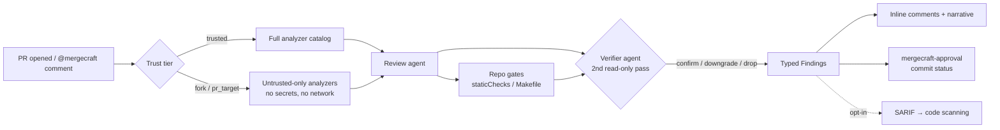
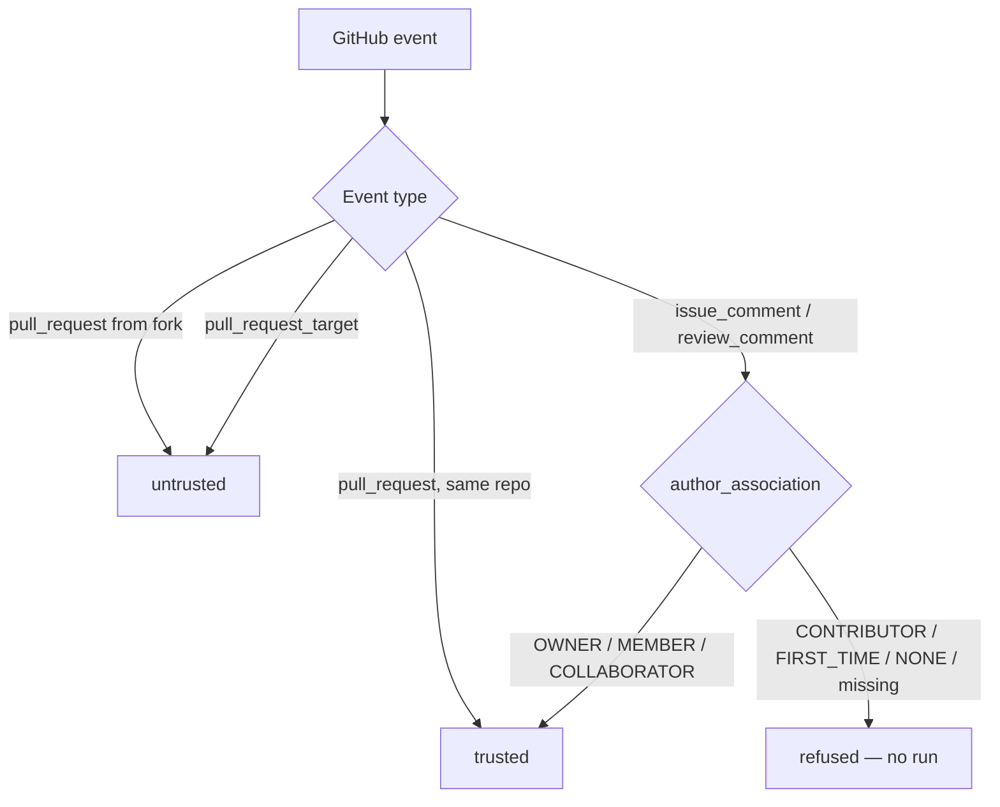

<div align="center">

<picture>
  <source media="(prefers-color-scheme: dark)" srcset="assets/brand/mark-dark.svg">
  
</picture>

# mergeCraft

**AI-powered PR review as a standalone, BYOK GitHub Action.**
No SaaS account. No dashboard. Your repo, your keys, your reviewers.

[](https://github.com/alexhawat/mergeCraft/actions/workflows/ci.yml)
[](https://github.com/alexhawat/mergeCraft/actions/workflows/codeql.yml)
[](https://github.com/alexhawat/mergeCraft/actions/workflows/docker.yml)
[](LICENSE)
[](pyproject.toml)

[Get started](#-get-started-in-3-steps) ·
[Features](#-features) ·
[Docs](docs/) ·
[Review checks](REVIEW-CHECKS.md) ·
[Contributing](CONTRIBUTING.md)

</div>

---

## Why mergeCraft?

Hosted AI reviewers (CodeRabbit et al.) want your code on their servers and a
per-seat subscription. mergeCraft is different:

- **BYOK** — bring your own Claude Pro/Max or ChatGPT subscription, or an API
  key. mergeCraft never talks to a proprietary backend; credentials and code
  stay inside GitHub Actions and this repo's code.
- **Evidence-first, not vibes-first** — deterministic analyzers and your repo's
  own gates settle mechanically checkable facts; the LLM only judges what's
  left, and a second read-only verifier re-reads every Critical/Major finding
  before it's published.
- **Fail-closed security** — untrusted contexts (fork PRs,
  `pull_request_target`, unknown commenters) degrade to a safe tier instead of
  running with secrets. Learnings memory is provenance-gated against prompt
  injection.
- **Zero lock-in** — one Docker action, one YAML workflow, MIT-licensed Python
  you can read end to end.

Inspired by [pullfrog](https://github.com/pullfrog/pullfrog) and CodeRabbit.

## ✨ Features

| | |
|---|---|
| 🔍 **Deep PR review** | Correctness, risk, blast-radius and hygiene lenses; inline findings + a short narrative verdict |
| 🧰 **Deterministic analyzers** | actionlint, zizmor, ShellCheck, Hadolint and more, auto-detected from changed paths — verified hits only, never guessed |
| ✅ **Structural approval gate** | `mergecraft-approval` commit status is a pure function of typed findings — the agent's own "approved" can never outvote a blocker |
| 🔁 **Model fallback chains** | Ordered `models:` list with per-slug `modelFallbacks:`; skips uncredentialed providers and retries past transient failures — `with: model:` becomes the chain head, not a kill-switch (see [Chain semantics](#chain-semantics--model)) |
| 🧠 **Provenance-gated memory** | `.mergecraft/learnings.md` persists cross-run knowledge; fork-authored entries are quarantined in `## Staging` until a maintainer promotes them |
| 🛡️ **Trust tiers** | Fork PRs and `pull_request_target` runs resolve to an untrusted tier: no secrets, no network, read-only analyzers |
| 📡 **SARIF upload (opt-in)** | Publish analyzer findings to GitHub code scanning with one flag |
| 📈 **Tracing (opt-in)** | Per-run span trees to local JSONL, Logfire, or any OTLP collector — with redaction |
| 💻 **Offline mode** | `mergecraft review` reviews local diffs, worktrees, or cloned repos — `--json` for benchmarks |
| 🧪 **Eval infrastructure** | Evidence packets, eval bank replay, and gate-and-bench scoring built in — benchmark numbers unpublished; run `make eval-replay` locally (see [evals/README.md](evals/README.md)) |

**Terminal verdict (default: enforce).** `gates.terminal_verdict` defaults to `enforce`: a run without a validated `submit_review_verdict` submission reports `inconclusive`. Set `gates.terminal_verdict: shadow` in `.mergecraft/config.yaml` to log diagnostics only. `create_pull_request_review` records through the same validator as `submit_review_verdict` and cannot approve without a validated terminal submission.

## 🗂️ Repository layout

One row per root-level directory, for anyone who has just cloned:

| Path | What it is |
|---|---|
| `src/mergecraft/` | The Python package — reviewer, analyzers, agents, MCP server, CLI, Action entry |
| `tests/` | Unit + integration suite |
| `docs/` | Reference documentation (`ANALYZERS.md`, `TRACING.md`, `REVIEW-DOCTRINE.md`, …) |
| `evals/` | Eval bank cases replayed by `mergecraft eval` |
| `examples/` | Consumer-facing example workflows, generated and drift-checked |
| `scripts/` | Repo tooling invoked from `make` (catalog check, coverage floors, doc generators) |
| `docker/` | Agent CLI pinning for the Action image |
| `get-installation-token/` | A small companion Action that mints a GitHub App installation token |
| `assets/brand/` | Brand SVGs and the source logo build script (see [assets/brand/README.md](assets/brand/README.md)) |
| `evidence/` | Committed CI debris awaiting removal — slated for deletion, do not add to it |
| `action.yml` / `Dockerfile` | The GitHub Action surface |

## 🏗️ How it works



<details>
<summary><b>Trust tiers & comment authorization</b> (click to expand)</summary>



The authorization decision reads `comment.author_association` from the event
payload — **never** the comment body — so writing `author_association: OWNER`
into a comment changes nothing. Details:
[Comment-trigger authorization](#comment-trigger-authorization).

</details>

## 🚀 Get started in 3 steps

> **Requirements:** **Python 3.14+** (hard requirement for `uv tool install` — see
> [pyproject.toml](pyproject.toml)), [uv](https://docs.astral.sh/uv/), an
> authenticated [GitHub CLI](https://cli.github.com), and one provider credential.
> **Without Python 3.14**, use the [Docker Action](#example-1--auto-review-every-pr)
> (`alexhawat/mergeCraft@…`) — the container image ships a compatible runtime; no
> local Python install needed ([`docs/distribution.md`](docs/distribution.md)).

**1. Install and scaffold** (in the repo you want reviewed):

```bash
uv tool install "git+https://github.com/alexhawat/mergeCraft@v0.1.0"
mergecraft init   # writes .mergecraft/config.yaml + .github/workflows/mergecraft.yml
```

**2. Authenticate** — use a subscription, no metered API billing:

```bash
mergecraft auth claude   # Claude Pro/Max
# or
mergecraft auth codex    # ChatGPT Plus/Pro/Team/Enterprise
```

The credential is saved as a GitHub Actions secret via `gh secret set`.

**3. Commit, push, and trigger** — open a PR, comment `@mergecraft review`, or
run the workflow manually. That's it: no server, dashboard, or account.

## 📖 Examples

### Example 1 — auto-review every PR

```yaml
# .github/workflows/mergecraft.yml
name: mergeCraft
on:
  pull_request:
  workflow_dispatch:

permissions:
  contents: write
  pull-requests: write
  issues: write
  id-token: write

jobs:
  review:
    runs-on: ubuntu-latest
    steps:
      - uses: actions/checkout@v5
      - uses: alexhawat/mergeCraft@v0.1.0
        env:
          CLAUDE_CODE_OAUTH_TOKEN: ${{ secrets.CLAUDE_CODE_OAUTH_TOKEN }}
```

> **Pin to the exact tag**, e.g. `@v0.1.0` — it is an immutable release ref and
> will not move, so a workflow run always reviews with the code that tag names.
> For the strictest supply-chain posture, pin a full commit SHA instead.

### Example 2 — hardened, review as a required check

When the review gates merges, use `pull_request_target` with trust-aware
restrictions — [`examples/workflows/mergecraft-hardened.yml`](examples/workflows/mergecraft-hardened.yml)
ships wait-for-CI, same-repo guards, and an enforce step that flips a `neutral`
approval check to blocking.

### Example 3 — local review before you push

```bash
mergecraft review                                        # uncommitted + branch changes vs origin/main
mergecraft review --repo .                               # explicit local checkout
mergecraft review --repo owner/repo --head feature       # public GitHub repo at a branch
mergecraft review --repo https://github.com/o/r --token "$GH_TOKEN"  # private repo
mergecraft review --staged                               # staged changes only
mergecraft review --diff changes.patch --dry-run         # inspect the prompt, no LLM call
mergecraft review --json findings.json                 # machine-readable Finding[] for scoring
mergecraft review --format sarif --output report.sarif.json
mergecraft review --format jsonl --output stream.jsonl
mergecraft review --agent                              # JSONL agent protocol on stdout
```

Process exit codes: `0` clean pass; `10` non-blocking findings; `11` blocking severities;
`20` inconclusive; `30` configuration error; `40` infra error; `50` timed out.

`diff-review` is a hidden alias of `review` (Harbor and existing scripts keep working).

**Auth precedence for private clones:** `--token` → `GH_TOKEN` / `GITHUB_TOKEN` →
`gh auth token` → anonymous (public repos only). Cloned third-party repositories
review at **untrusted** tier unless you pass an explicit `--trust trusted` override.

### Example 4 — multi-model with fallback

```yaml
# .mergecraft/config.yaml
models:
  - anthropic/claude-sonnet
  - openai/gpt-5.3-codex
  - google/gemini-3.1-pro-preview
modelFallbacks:
  anthropic/claude-sonnet:
    - anthropic/claude-opus
push: restricted
shell: restricted
staticChecks:
  - name: lint
    command: make lint
```

Add `model: <slug>` to the workflow `with:` block to pick the **head** of
the chain (default chain head is the first `models:` entry); the configured
fallbacks are walked on credential miss or retryable failure. See
[Chain semantics](#chain-semantics--model-37--w4) for the contract.

### Example 5 — SARIF upload to code scanning (opt-in)

Publish analyzer findings as GitHub code-scanning alerts — off by default,
requires `security-events: write`:

```yaml
permissions:
  contents: read
  pull-requests: write
  security-events: write   # required — without it GitHub answers 403

jobs:
  review:
    steps:
      - uses: alexhawat/mergeCraft@v0.1.0
        with:
          sarif_upload: enabled
```

Only findings admitted by the run's trust tier, `shell:` policy and
`analyzers:` mode are uploaded, after secret redaction — agent narrative is
never uploaded. Details: [docs/ANALYZERS.md](docs/ANALYZERS.md).

Full config reference: [`examples/config.yaml`](examples/config.yaml).

### Example 6 — Tracing with Logfire (opt-in)

Every run can emit a per-request span tree — to local JSONL, to
[Logfire](https://logfire.pydantic.dev/), or to any OTLP collector — off by
default:

```yaml
- uses: alexhawat/mergeCraft@v0.1.0
  with:
    tracing: enabled
    tracing-to: logfire
  env:
    LOGFIRE_TOKEN: ${{ secrets.LOGFIRE_TOKEN }}
```

One `trace_id` groups every span from a run into a single tree, so a
Logfire trace view of a real review reads top to bottom as:

```
mergecraft.run
└── agent.attempt          (per fallback entry: model.id, status, ...)
    ├── provider.call      (once per upstream API request)
    │   ├── http.client.request
    │   └── llm.call       (model.id, cost.*, gen_ai.usage.*)
    └── tool.call           (tool.name, tool.server)
```

`gen_ai.*` attrs on `llm.call` / `provider.call` follow the GenAI
semantic-convention keys, so Logfire's built-in AI panels group and render
them without extra config. Full config schema, the redaction guarantee, and
the payload/span-count caps: [docs/TRACING.md](docs/TRACING.md).

<!-- Asset pending: a screenshot of this trace tree for a real review,
committed under assets/ and linked here — operator-captured, see the
issues-showcase-readiness wave plan (PR G5 / D7). -->

## 🔑 Authentication

| Provider | Subscription (recommended) | API key |
|----------|-----------------------------|---------|
| Anthropic Claude | `mergecraft auth claude` → `CLAUDE_CODE_OAUTH_TOKEN` (Claude Pro/Max) | `ANTHROPIC_API_KEY` |
| OpenAI Codex | `mergecraft auth codex` → `CODEX_AUTH_JSON` (ChatGPT Plus/Pro/Team/Enterprise) | `OPENAI_API_KEY` |
| Google Gemini | `mergecraft auth gemini` → `GEMINI_API_KEY` (AI Studio) | `GEMINI_API_KEY` / `GOOGLE_GENERATIVE_AI_API_KEY` |
| Nous Portal | — (API key) | `mergecraft auth nous` → `NOUS_API_KEY` (`nous/deepseek/deepseek-v4-flash`) |
| Tencent TokenHub | — (API key) | `mergecraft auth tokenhub` → `TOKENHUB_API_KEY` (`tokenhub/hy3` + any TokenHub model) |
| MiniMax | — (API key) | `mergecraft auth minimax` → `MERGECRAFT_CUSTOM_PROVIDER_API_KEY` (`minimax/MiniMax-M3`; OpenAI-compatible, default `https://api.minimax.io/v1`) |
| Cursor Cloud | `mergecraft auth cursor` → `CURSOR_API_KEY` | `CURSOR_API_KEY` |
| Logfire tracing | `mergecraft auth logfire` → `MERGECRAFT_LOGFIRE_TOKEN` + `MERGECRAFT_TRACING_PROJECT` (local) and `LOGFIRE_TOKEN` (Actions) | see [`docs/TRACING.md`](docs/TRACING.md) |

Subscription auth runs the official `claude` / `codex` / `gemini` CLIs as *you*
— the same credential your local coding agent uses. Only set env vars for
providers you actually use.

> **Codex on container runners:** Codex CLI's nested bubblewrap sandbox fails
> inside namespaced containers. On an already-isolated ephemeral runner, pass
> `codex_sandbox: danger-full-access`. mergeCraft never sets this itself —
> its own `shell`/`push` controls remain the security boundary
> ([issue #70](https://github.com/alexhawat/mergeCraft/issues/70)).

### Custom OpenAI-compatible provider

For any OpenAI-compatible endpoint (Nous Portal, Tencent TokenHub,
MiniMax, OpenRouter, a self-hosted vLLM, etc.), mergeCraft exposes one
mechanism that both harnesses consume. Issue
[#71](https://github.com/alexhawat/mergeCraft/issues/71) closes on this
surface — the **Codex half** is new in `v0.0.x`; the OpenCode half
shipped earlier in PR
[#79](https://github.com/alexhawat/mergeCraft/pull/79) and is
regression-tested.

#### Env-var convention

| Form | Example | Provider id |
|------|---------|-------------|
| Singleton back-compat alias (PR #79 / D7) | `MERGECRAFT_CUSTOM_PROVIDER_BASE_URL` + `MERGECRAFT_CUSTOM_PROVIDER_API_KEY` | `default` (or the active model's prefix when the model is `nous/...` or `tokenhub/...`) |
| Indexed multi-provider | `MERGECRAFT_CUSTOM_PROVIDER_BASE_URL_1` + `MERGECRAFT_CUSTOM_PROVIDER_API_KEY_1`, `_2`, `_3`, … | `provider_1`, `provider_2`, `provider_3`, … |

Indexed env vars are operator-locked — both halves of each numeric pair
must be set with non-empty values; partial pairs are silently dropped.
Discovery enumerates every matching suffix, sorts by numeric `N`
ascending, and preserves gaps (no renumbering). When any indexed pair is
set, the singleton is ignored.

#### Action inputs (`with:`)

For the common single-provider case, two top-level `with:` inputs map
onto the singleton env vars — no need to name them in `env:`:

```yaml
- uses: alexhawat/mergeCraft@v0.1.0
  with:
    model: default/your-model-id
    provider_base_url: https://api.example.com/v1
    provider_api_key_env: MY_PROVIDER_API_KEY   # the NAME of an env var, not the key value
  env:
    MY_PROVIDER_API_KEY: ${{ secrets.MY_PROVIDER_API_KEY }}  # wire the secret here
```

`provider_api_key_env` is the **env-var name** that holds the key;
mergeCraft reads that env var's value and re-exports it as
`MERGECRAFT_CUSTOM_PROVIDER_API_KEY`. The resolved key value is never
inlined into the workflow file and never logged (convention 7). For
multi-provider setups, fall back to the indexed env-var form below —
`with:` cannot enumerate multiple providers.

<!-- BEGIN:action-inputs -->
The full input list:

| Input | Default | Description |
|-------|---------|-------------|
| `allow_pr_target_comments` | `false` | Opt-in to comment-driven invocation under `pull_request_target`. Default: false (refused). When set to `true`, comments from authors in {OWNER, MEMBER, COLLABORATOR} dispatch the agent even under `pull_request_target`. Set this only on workflows whose `if:` already gates comment triggers to trusted authors; leave it off everywhere else. See issue #72 / D6. |
| `analyzers` | `auto` | Analyzer execution tier: off (disabled), auto (detect + provision), full (baked image tools), or untrusted-only (trust-aware: run only analyzers that need no secrets, no network and no PR-authored command construction — trusted-tier and repo-native manifests are skipped with a named reason rather than failing). Under `pull_request_target` and fork-head pull requests, `auto` resolves to `untrusted-only`. An unrecognised value also resolves to `untrusted-only`, with a warning. Default: auto |
| `codex_sandbox` | _(unset)_ | Codex platform-sandbox policy. Leave unset (default) to keep Codex's own bubblewrap/Landlock sandbox. Set to `danger-full-access` ONLY when the runner is already an ephemeral, isolated container — inside a Docker container action, bubblewrap cannot create a nested user namespace and every Codex call fails before doing work. mergeCraft's own shell/push controls are unaffected either way. See issue #70. |
| `cwd` | _(unset)_ | Working directory for the agent (defaults to GITHUB_WORKSPACE) |
| `logfire-token` | _(empty)_ | Direct logfire token (W8.5 / W7.7). Wire from a `LOGFIRE_TOKEN` GitHub Actions secret (interpolated in your workflow YAML, not written literally here) so the secret never appears in the workflow file. Held at runtime only; never inlined into config dumps. |
| `model` | _(unset)_ | Model to use — a curated slug (e.g. anthropic/claude-opus, tokenhub/hy3, nous/deepseek/deepseek-v4-flash) or a raw models.dev specifier. Overrides repo settings. OpenAI-compatible gateways: set NOUS_API_KEY or TOKENHUB_API_KEY (or MERGECRAFT_CUSTOM_PROVIDER_*). Default behaviour (#37 / W4): the supplied `model:` becomes the **head** of the configured chain — the repo's `models:` list (and any `modelFallbacks:`) is retained as the tail and walked on credential miss or retryable failure. To restore the legacy "use exactly this model, suppress the chain" semantics, set `model_pin: enabled`. |
| `model_pin` | `disabled` | #37 / W4 / D8 — opt into the legacy "use exactly this model" semantics for the `model:` input. Default `disabled`: `model:` becomes the chain head; the configured `models:` / `modelFallbacks:` tail is walked on credential miss or retryable failure. Set to `enabled` to collapse the chain to `[model]` (suppress fallbacks). Wire this through `.mergecraft/ config.yaml`'s `modelPin: true` for repo-wide default; the action input wins. |
| `otel-endpoint` | _(empty)_ | OTLP collector URL (W8.5 / W7.7): e.g. `http://127.0.0.1:4318/v1/traces`. Wins over the config block. |
| `output_schema` | _(unset)_ | JSON Schema (draft-07) for structured output validation. |
| `prompt` | _(unset)_ | Prompt to send to the agent (string or JSON payload) |
| `prompt_file` | _(unset)_ | Path to a file (relative to GITHUB_WORKSPACE) whose contents are used as the prompt. Set exactly one of prompt or prompt_file. |
| `provider_api_key_env` | _(unset)_ | Name of an environment variable that holds the singleton provider's API key (e.g. `MY_PROVIDER_API_KEY`). mergeCraft reads this env var's value and exposes it to the harness as `MERGECRAFT_CUSTOM_PROVIDER_API_KEY`. Never inline the API key value here — reference the env-var *name* only (convention 7). Wire the secret via the workflow's `env:` block from a GitHub Actions secret named `MY_PROVIDER_API_KEY` (interpolated in your workflow YAML, not written literally here — a literal `secrets.*` expression inside this file's own description text fails action.yml validation, since `secrets` isn't a valid context for a composite action's metadata). See issue #71. |
| `provider_base_url` | _(unset)_ | Custom OpenAI-compatible base URL for the singleton provider (`MERGECRAFT_CUSTOM_PROVIDER_BASE_URL`, PR #79 / D7). Use this to point Codex or OpenCode at a third-party OpenAI-compatible gateway without committing env-var names in workflow YAML. The indexed multi-provider form (`MERGECRAFT_CUSTOM_PROVIDER_{API_KEY,BASE_URL}_<N>` for `N >= 1`) is env-only and not exposed here — that path is for advanced multi-provider setups where `with:` cannot enumerate multiple entries. See issue #71. |
| `push` | _(unset)_ | Git push permission: disabled, restricted, or enabled. Default: restricted |
| `sarif_upload` | `disabled` | Upload catalog-analyzer findings to GitHub code scanning as SARIF 2.1.0: disabled (default) or enabled. Complementary evidence for when the review narrative is thin or findings overflow the inline comment budget — never a gate: an upload failure is logged and the run still completes. Requires `security-events: write` on the job, and code scanning to be available on the repository. Only findings from catalog analyzers that this run's trust tier, shell policy and `analyzers:` mode actually admitted are uploaded, after secret redaction. CI-sourced and agent-sourced findings are never uploaded. An unrecognised value resolves to disabled, with a warning. When unset, `.mergecraft/config.yaml`'s `analyzers.sarifUpload` decides (default false). See issue #39. |
| `setup_failure_policy` | _(empty)_ | S1 / D10 — what happens when a trusted-tier `setupScript` fails (non-zero exit) or times out. `inconclusive` (default) maps the run to `RunOutcome.inconclusive` (a `neutral` check conclusion) — the run is treated as no-verdict, never a passing review of an under-provisioned tree. `fail` aborts the run as `RunOutcome.configuration_error` (the consumer has declared the failure is unrecoverable). `warn` reproduces the legacy continue-on-failure behaviour; the prompt still carries the failure text so the reviewing agent knows its tree may be partially provisioned. Unknown values fail closed as `configuration_error` (this is a security/runtime surface — `extra="forbid"` semantics). |
| `setup_timeout` | _(empty)_ | S1 / F6 — maximum wall-clock duration for `setupScript` (e.g. `5m`, `30s`, `1h`). A hanging install stalls the run otherwise. The setup runs as a session leader so its whole process tree is TERM→KILLed on timeout. Reusing `resolve_timeout_ms` — the same parser the `timeout` input uses. Default `10m` applies even when `timeout` is unset or `--notimeout`; setup never consumes the whole run budget. Note: `setupTimeout` must be strictly less than `timeout` (or the run aborts as `configuration_error`). Equal / larger budgets would let the setup script eat the whole run deadline; the agent is then given ≈1 ms and a setup timeout surfaces as `timed_out` instead of the `inconclusive` / `configuration_error` the setup policy was supposed to produce. Lower `setupTimeout` or raise `timeout` to satisfy the guard — see `docs/config-failure-policy.md` for the runtime reason text. |
| `shell` | _(unset)_ | Shell permission: disabled, restricted, or enabled. |
| `status_checks` | _(unset)_ | Post mergecraft and mergecraft-approval commit-status checks: disabled (default) or enabled. |
| `suggest_eval_add` | `disabled` | Opt-in (W12.4 / #44): when enabled, log a logger.info suggestion to add the run to the eval bank when the run produced no positive findings, the trust tier is trusted, and the trigger is a re-review (not a fresh PR). Accepts disabled\|enabled (also true/false aliases). Default: disabled; mergeCraft never auto-adds. |
| `timeout` | _(unset)_ | Maximum run duration (e.g., 10m, 1h30m). Default: 1h |
| `token` | `${{ github.token }}` | GitHub-provided token with job-scoped permissions. |
| `tracing` | _(empty)_ | Tracing enablement (W8.5 / W7.7): true / false. Wins over the .mergecraft/config.yaml `tracing.enabled` block when set. Unset defers to the config (default off). |
| `tracing-to` | _(empty)_ | Tracing shorthand (W8.5 / W7.7): `local_files` / `logfire` / `otel`. Wins over the config block. `logfire` requires the optional `[tracing]` extra plus a `LOGFIRE_TOKEN` secret wired via `logfire-token` below; `otel` requires an `otel-endpoint`. |
<!-- END:action-inputs -->

Behavioural note: `setup_failure_policy`'s and `setup_timeout`'s literal
`action.yml` default is an empty string (unset defers to the S1/D10 policy
described below); the *effective* runtime default when left unset is
`inconclusive` and `10m` respectively.

- S1 / D10 — what a trusted-tier `setupScript` failure (non-zero exit **or**
  timeout) maps to: `inconclusive` (effective default — neutral check
  conclusion, the run is no-verdict), `fail` (`configuration_error`), or
  `warn` (run continues; prompt still carries the failure text). Closed
  vocabulary — unknown values fail closed as `configuration_error` before the
  run starts.
- S1 / F6 — `setup_timeout`'s effective default (`10m`) is the wall-clock
  budget for `setupScript` (e.g. `5m`, `30s`, `1h`). A hanging install stalls
  the run otherwise. Reuses the same duration grammar as `timeout`. The setup
  runs as a session leader so a TERM → grace → KILL on the deadline reaches
  the whole process tree.

#### Action outputs

<!-- BEGIN:action-outputs -->
| Output | Description |
|--------|-------------|
| `evidence_packet` | JSON body of this run's Merge Evidence Packet (#47) — the versioned, structured record of the findings, deterministic checks, blast-radius lane, self-assessment, and decision behind the review. Emitted via `$GITHUB_OUTPUT` as multiline JSON (not a filesystem path). Empty when the run had no pull request to attest to. To upload as an artifact, write the output to a file in a later step. Schema: `docs/evidence-packet.md`. |
| `result` | Set when the prompt requests it; required when output_schema is provided. |
| `verdict_diagnostic` | Closed VerdictDiagnostic code from the terminal-verdict policy path for this run. Empty when the run did not evaluate terminal protocol policy. |
<!-- END:action-outputs -->

#### Worked example — Nous-hosted DeepSeek V4 Flash

A raw pass-through slug reaches Nous's OpenAI-compatible endpoint via
either harness:

```yaml
- uses: alexhawat/mergeCraft@v0.1.0
  with:
    model: nous/deepseek/deepseek-v4-flash  # raw pass-through slug
  env:
    NOUS_API_KEY: ${{ secrets.NOUS_API_KEY }}      # preset path — no MERGECRAFT_* needed
```

The model prefix `nous` resolves against `NOUS_API_KEY` (set above) and
`https://inference-api.nousresearch.com/v1`. The harness then registers
the provider, sets `enabled_providers = ["nous"]`, and serves the model.

#### Multi-provider — Codex-side indexed pairs

Two distinct OpenAI-compatible providers in one workflow (e.g. MiniMax
and Nous alongside OpenAI):

```yaml
- uses: alexhawat/mergeCraft@v0.1.0
  with:
    model: provider_1/deepseek-v4-flash           # active provider_1
  env:
    MERGECRAFT_CUSTOM_PROVIDER_BASE_URL_1: https://inference-api.nousresearch.com/v1
    MERGECRAFT_CUSTOM_PROVIDER_API_KEY_1:  ${{ secrets.NOUS_API_KEY }}
    MERGECRAFT_CUSTOM_PROVIDER_BASE_URL_2: https://api.MiniMax.io/v1
    MERGECRAFT_CUSTOM_PROVIDER_API_KEY_2:  ${{ secrets.MINIMAX_API_KEY }}
```

Codex writes the corresponding `config.toml`:

```toml
[model_providers.provider_1]
name = "provider_1"
base_url = "https://inference-api.nousresearch.com/v1"
env_key = "MERGECRAFT_CUSTOM_PROVIDER_API_KEY_1"
wire_api = "responses"

[model_providers.provider_2]
name = "provider_2"
base_url = "https://api.MiniMax.io/v1"
env_key = "MERGECRAFT_CUSTOM_PROVIDER_API_KEY_2"
wire_api = "responses"
```

The `env_key` field references the **env-var name**, not the resolved
key value — convention 7. The harness reads the env var at exec time.

#### Which harness handles which

**Harness vs provider vs model.** OpenCode is the generic multi-provider
harness (OpenAI-compatible gateways, Nous, TokenHub, custom providers).
Codex is the OpenAI-native harness. **Nous** is a *provider* (inference
gateway); **DeepSeek** is a *model family* under that provider — not a
harness name. Set `harness:` in `.mergecraft/config.yaml` to pick the
runtime independently of `model:`; when unset, mergeCraft infers the
harness from the model slug (see matrix below).

| Model slug (unset `harness`) | Inferred harness | Explicit override exercised by tests |
|------------------------------|------------------|--------------------------------------|
| `nous/deepseek-v4-flash` | `opencode` | — |
| `nous/deepseek/deepseek-v4-flash` | `opencode` | — |
| `openai/gpt-5.3-codex` | `codex` | `harness: opencode` → `opencode` |
| `anthropic/claude-sonnet` | `claude` | `harness: opencode` → `opencode` |
| `google/gemini-3.1-pro-preview` | `gemini` | — |
| `cursor/cloud-agent` | `cursor` | — |
| `nous/deepseek/deepseek-v4-flash` + `harness: claude` | — | **configuration error** (names both halves) |

| Harness | Format written | Where it lives |
|---------|----------------|----------------|
| OpenCode | `provider.<id>.options.baseURL` / `.apiKey` (JSON) | `OPENCODE_CONFIG_CONTENT` (inline) and `OPENCODE_CONFIG` (file) |
| Codex CLI 0.146 | `[model_providers.<id>]` with `base_url` / `env_key` / `wire_api = "responses"` (TOML) | `$CODEX_HOME/config.toml` |

Both harnesses consume the same shared resolver
(`src/mergecraft/agents/openai_compatible_gateways.py`), so the env-var
contract is one — pass-through slugs (`<provider>/<model>`) route to
the right harness via the existing chain logic. OpenAI-compatible
models route to the OpenCode harness (no first-party Codex provider);
"true" OpenAI models route to Codex.

> PR [#79](https://github.com/alexhawat/mergeCraft/pull/79) shipped the
> OpenCode side of this feature; the Codex side, the `with:` input
> surface, and the env-var multi-provider extension all land together in
> this release — see issue
> [#71](https://github.com/alexhawat/mergeCraft/issues/71).

### Chain semantics — `model:` (#37 / W4)

The `with: model:` input is the **chain head**, not a chain kill-switch.
The configured `models:` / `modelFallbacks:` tail is preserved and walked
on credential miss or retryable failure. Issue
[#37](https://github.com/alexhawat/mergeCraft/issues/37) closes on this.

```yaml
# .mergecraft/config.yaml — the configured chain
models:
  - anthropic/claude-sonnet
  - openai/gpt-5.3-codex
  - google/gemini-3.1-pro-preview
modelFallbacks:
  anthropic/claude-sonnet:
    - anthropic/claude-opus
```

```yaml
# .github/workflows/mergecraft.yml — a single ``uses:`` step walks the
# chain. ``model:`` is the head; the configured tail follows.
- uses: alexhawat/mergeCraft@v0.1.0
  with:
    model: anthropic/claude-sonnet        # ← chain head (your pick)
    # model_pin: enabled                 # ← uncomment to collapse to one model
  env:
    ANTHROPIC_API_KEY: ${{ secrets.ANTHROPIC_API_KEY }}
    OPENAI_API_KEY: ${{ secrets.OPENAI_API_KEY }}
    GEMINI_API_KEY: ${{ secrets.GEMINI_API_KEY }}
```

Effective chain in the example above (with the operator-named head
preserved as the first entry):

```text
[anthropic/claude-sonnet, anthropic/claude-opus,
 openai/gpt-5.3-codex, google/gemini-3.1-pro-preview]
```

`MERGECRAFT_MODEL` (env var) follows the same rule: it joins as the head.

#### Escape hatch — `model_pin: enabled`

To restore the legacy "use exactly this model, suppress fallbacks"
semantics, set `model_pin: enabled` on the `with:` block, or
`modelPin: true` in `.mergecraft/config.yaml` (the action input wins):

```yaml
- uses: alexhawat/mergeCraft@v0.1.0
  with:
    model: anthropic/claude-sonnet
    model_pin: enabled                 # ← chain collapses to [claude-sonnet]
```

#### Action parity with `models:`

`models:` is the chain, `model:` is the head. `models:` alone (without
`with: model:`) is supported and unchanged — the chain runs as configured.
A workflow that used to dual-step (`if: HAS_CLAUDE` → one review, else
`if: HAS_OPENAI` → another) collapses to a single step.

## 🧰 CLI

The full command list (one row per real leaf command — pass `--help` to any
of them for its full flag set):

<!-- BEGIN:cli-commands -->
| Command | Description |
|---------|-------------|
| `mergecraft agents list` | List agent bindings with model chain, prompt id, and tool count. |
| `mergecraft agents set <role>` | Write a single agent binding override into `.mergecraft/config.yaml`. |
| `mergecraft agents show <role>` | Show resolved prompt text and MCP tool names for one role. |
| `mergecraft analyzers detect` | Show analyzers that would run for changed paths in this repo. |
| `mergecraft analyzers docs` | Regenerate `docs/ANALYZERS.md` from manifests. |
| `mergecraft analyzers explain <analyzer-id>` | Print manifest fields and notes for one analyzer. |
| `mergecraft analyzers export <analyzer-id>` | Run one analyzer and export findings as SARIF. |
| `mergecraft analyzers list` | List catalog analyzers and whether they would enable here. |
| `mergecraft analyzers lock` | Write or refresh `.mergecraft/analyzers.lock` for managed tools. |
| `mergecraft analyzers run <analyzer-id>` | Execute one analyzer against the working tree. |
| `mergecraft auth claude` | Save a Claude Code OAuth token as CLAUDE_CODE_OAUTH_TOKEN. |
| `mergecraft auth codex` | Mint a Codex subscription credential and save it as CODEX_AUTH_JSON. |
| `mergecraft auth cursor` | Save a Cursor API key as CURSOR_API_KEY. |
| `mergecraft auth gemini` | Save a Gemini API key as GEMINI_API_KEY. |
| `mergecraft auth logfire` | Save a Logfire write token + project for the `logfire` tracing sink. |
| `mergecraft auth minimax` | Save a MiniMax API key as MERGECRAFT_CUSTOM_PROVIDER_API_KEY. |
| `mergecraft auth nous` | Save a Nous Portal API key as NOUS_API_KEY. |
| `mergecraft auth tokenhub` | Save a Tencent TokenHub API key as TOKENHUB_API_KEY. |
| `mergecraft config explain <key>` | Explain which precedence layer wins for a config key. |
| `mergecraft config show <key>` | Show a resolved config value and the precedence layer that supplied it. |
| `mergecraft config tracing` | Render the resolved tracing config — sinks, retention, redaction, token redacted. |
| `mergecraft config validate` | Validate repo config — unknown keys are rejected (extra=forbid). |
| `mergecraft diff-review` | Review a local git diff offline (no GitHub Action / PR posting). |
| `mergecraft doctor` | Diagnose git, providers, analyzers, auth, config, and MCP wiring. |
| `mergecraft eval add` | Add a case to the bank. |
| `mergecraft eval bench` | Join structural decision replay with a live finding-location run (#140, B3). |
| `mergecraft eval gate` | Check the eval bank's integrity — the CI-safe half of the eval loop. |
| `mergecraft eval list` | List cases in the bank. |
| `mergecraft eval promote <case-id>` | Promote a case into a permanent pytest test file (#44, W12.1). |
| `mergecraft eval replay <case-id>` | Replay a case and report the diff. |
| `mergecraft eval replay-bank` | Replay the eval bank and write a versioned benchmark result set (#140). |
| `mergecraft eval score <actual> <expected>` | Score review findings against a frozen benchmark baseline. |
| `mergecraft findings carryover --pr N` | File one issue per unresolved mergeCraft finding. Dry run unless `--apply`. |
| `mergecraft findings export --pr N` | Print the findings a merge would bury. Never writes anything. |
| `mergecraft gha token` | Acquire a GitHub App installation token, or revoke it with `--post`. |
| `mergecraft init` | Scaffold `.mergecraft/config.yaml` and an example workflow (local, no API). |
| `mergecraft learnings active` | List only the active (promoted) learning entries. |
| `mergecraft learnings influence` | List active + staging learning entries with their provenance. |
| `mergecraft learnings staging` | List only the staging (quarantined) learning entries. |
| `mergecraft lens list` | List bundled lens ids and display titles. |
| `mergecraft lens show <lens-id>` | Show rubric, triggers, evidence, and tool classes for one lens. |
| `mergecraft lens test <lens-id>` | Preview one lens dispatch (rubric + routing context) for a diff fixture. |
| `mergecraft models list` | List curated model slugs and whether credentials are detected locally. |
| `mergecraft models set <slugs>` | Write an ordered `models:` list to `.mergecraft/config.yaml`. |
| `mergecraft models show` | Show effective model order, env override, and the slug that would win now. |
| `mergecraft pipeline explain` | Print pipeline step ids and predicate vocabulary. |
| `mergecraft pipeline lint` | Validate the pipeline file and registry agent references. |
| `mergecraft pipeline show --diff DIFF` | Preview which pipeline steps would run or skip for a diff. |
| `mergecraft plan` | Preview model chain, toolset, analyzers, and token estimate without provider calls. |
| `mergecraft review` | Review a local git diff offline (no GitHub Action / PR posting). |
| `mergecraft traces show <run-id>` | Read back the local JSONL traces for the given run id (re-redacts on render). |
| `mergecraft tracing logfire disable` | Disable Logfire tracing by removing the token + project locally and on GitHub. |
| `mergecraft tracing logfire enable` | Enable Logfire tracing by writing the token + project locally and on GitHub. |
| `mergecraft tracing logfire unwire-workflow` | Remove Logfire tracing wiring from the consumer workflow. |
| `mergecraft tracing logfire wire-workflow` | Wire Logfire tracing into the consumer workflow. |
| `mergecraft version` | Show the mergeCraft package version. |
| `mergecraft watch --pr N` | Stream a PR/issue timeline as one JSON line per new event. |
<!-- END:cli-commands -->

The bare `gha` group invocation (no subcommand) is the Docker action's
runtime entry point — it is a Typer group callback, not a
`registered_commands` leaf itself, so it is described here in prose rather
than as its own table row; `gha token` above is the one real leaf command
under that group.

## 🔒 Security model

- **BYOK by design** — credentials and repo content never leave GitHub
  Actions / your machine and this repo's code.
- **Comment triggers are authorized, not authenticated-by-content** — only
  `OWNER`/`MEMBER`/`COLLABORATOR` associations can invoke; the body is never
  consulted. Two opt-in knobs (`allow_pr_target_comments`,
  `commentInvocationAllowlist`) each widen exactly one axis.
- **Learnings are fail-closed** — entries land in `## Staging`; only
  maintainer-associated authors promote to `## Active`, and active entries are
  nonce-fenced before the model reads them.
- **The approval check is structural** — `success` requires a completed trusted
  run with no Critical/Major findings; `failure` on any blocker; `neutral` for
  crashes, timeouts, and untrusted tiers. The agent's narrative approval is
  advisory only.
- **Analyzers under low trust run untrusted-only** — no secrets, no network, no
  PR-authored command construction; exclusions are reported as named skips.
- **Agent subprocess env is an explicit allowlist** — agent CLIs never
  inherit the full process environment. Stripped by default: ``GIT_ASKPASS``,
  ``GITHUB_TOKEN``/``GH_TOKEN``, ``ACTIONS_ID_TOKEN_*``, and every non-active
  provider API key. Git authentication for agent operations is brokered
  per-invocation via MCP git's ``http.extraHeader`` injection, not ambient
  askpass. Retained askpass files (entrypoint bookkeeping only) live at
  ``0o600`` inside a ``0o700`` credentials directory the agent cannot read.
  Run temp dirs and registered leak-surface paths are removed on success and
  failure; ``wipe_runner_leak_surface`` only unlinks mergeCraft-owned paths.
- **`push` / `shell` value semantics are defined in the action-inputs
  table** — see [Action inputs (`with:`)](#action-inputs-with) above for the
  `disabled` / `restricted` / `enabled` vocabulary both inputs share.
- **Containment hardening** — ``safe.directory`` is scoped to
  ``$GITHUB_WORKSPACE`` and registered cross-repo checkout roots (no wildcard).
  Git hooks run only when ``shell: enabled``; ``restricted`` and ``disabled``
  neutralize hooks via ``core.hooksPath``. ``cwd`` and MCP shell
  ``working_directory`` must resolve inside allowed workspace roots. Agent CLI
  subprocesses drop to the unprivileged ``mergecraft`` user via ``setpriv``
  while the action entrypoint stays root for GitHub file commands.
- **Network is outside the hard sandbox guarantee when ``unshare --net`` is
  unavailable (W12.7)** — on CI hosts that support it, untrusted MCP shell
  spawns with ``unshare --pid --net`` so the child has an empty network
  namespace. Where that probe fails (macOS runners, restricted containers,
  missing CAP_SYS_ADMIN), shell egress is not kernel-isolated; the W2
  credential allowlist (no ambient ``GITHUB_TOKEN`` / provider keys / askpass)
  remains the binding control. Trusted-tier shell does not force ``--net`` so
  provider CLIs can still reach their APIs.

Report vulnerabilities via [SECURITY.md](SECURITY.md). What a review does and
never does: [REVIEW-CHECKS.md](REVIEW-CHECKS.md).

## ⚙️ Workflow-placement gotchas (`pull_request_target`)

GitHub resolves `pull_request_target` workflows from the **default branch** —
the workflow file *and* the checked-out commit, whatever base the PR targets
([Nov 2025 policy](https://github.blog/changelog/2025-11-07-actions-pull_request_target-and-environment-branch-protections-changes/),
effective 2025-12-08). Three consequences:

- **A copy on a non-default trunk is inert.** If `main` is a stub and real work
  lands on a staging branch, this workflow still has to live on `main`.
- **`GITHUB_REF` / `GITHUB_SHA` point at the default branch**, not the PR base —
  so a bare `actions/checkout` lands on default-branch tip and
  `.mergecraft/config.yaml` is read from there. Environment branch-protection
  rules also now evaluate against the default branch; update environment
  filters if you gate secrets that way.
- **A PR that edits this workflow is still reviewed — by the default-branch
  copy.** Its own edits apply to the *next* PR, after merge. (That much was
  always true of `pull_request_target`; what Nov 2025 changed is base branch →
  default branch.)

If the review is **not** a required check, prefer plain `pull_request` — simpler,
and no secrets in scope. The case for accepting `pull_request_target` is narrower
than it looks: GitHub cannot build `refs/pull/N/merge` for a conflicted PR, so
`pull_request` runs are skipped and a *required* review check sits unreported
for as long as the conflict lasts. `pull_request_target` still fires on
`synchronize` in that state, so the review lands — and its verdict is visible —
while the PR is still conflicted.

That is the whole of the benefit, and it is worth stating plainly: pushing the
conflict fix to the PR branch fires `synchronize` and clears a `pull_request`
check too, so the gap is the conflicted window, not a permanent block. It
outlasts the conflict only when the conflict disappears *without* a push to the
head branch — the base moved, say — because nothing then re-triggers the run.
A conflicted PR is unmergeable on its own account anyway, so weigh this against
running with secrets in scope rather than treating it as decisive.

If you pin the action SHA in more than one place, gate the copies against each
other in CI — and read the workflow side from the **default branch**
(`git show origin/main:.github/workflows/mergecraft.yml`), not the working tree.
Bump order is default branch first, local pin second.

Since [June 2026](https://github.blog/changelog/2026-06-18-safer-pull_request_target-defaults-for-github-actions-checkout/)
`actions/checkout` refuses to check out fork PR code under `pull_request_target`
unless you pass `allow-unsafe-pr-checkout` (v7 GA 2026-06-18, backported to all
supported majors 2026-07-20). mergeCraft's shipped workflows are unaffected —
they check out the default branch with no `ref:` and reach PR content through
`checkout_pr` and the API, never by executing PR-authored code with secrets in
scope.

Full rationale in the collapsible sections of
[docs](docs/).

## 📚 Documentation

| Doc | What it covers |
|-----|----------------|
| [REVIEW-CHECKS.md](REVIEW-CHECKS.md) | Every check a review applies — lenses, gates, grading, what it never reports |
| [docs/ANALYZERS.md](docs/ANALYZERS.md) | Analyzer catalog, trust tiers, SARIF upload |
| [docs/TRACING.md](docs/TRACING.md) | Opt-in span trees: JSONL, Logfire, OTLP |
| [docs/REVIEW-DOCTRINE.md](docs/REVIEW-DOCTRINE.md) | Why mergeCraft makes the calls it makes |
| [docs/evidence-packet.md](docs/evidence-packet.md) | Typed findings & merge evidence |
| [docs/eval-bank.md](docs/eval-bank.md) | Eval replay and bench scoring |
| [docs/distribution.md](docs/distribution.md) | 0.1.0 release checklist — PyPI, Marketplace, assets ([#141](https://github.com/alexhawat/mergeCraft/issues/141)) |
| [CONTRIBUTING.md](CONTRIBUTING.md) | Contributor workflow (`make setup / lint / typecheck / test / ci`) |

## 🗺️ Roadmap

- [ ] PyPI release (`pip install merge-craft`)
- [ ] GitHub Marketplace listing
- [ ] Cursor local CLI harness (issue #13 Phase B)
- [ ] Expanded analyzer catalog (opt-in long tail)
- [ ] Published eval benchmarks — **unpublished** (D19 partial: structural replay harness + versioned result sets landed in W9; precision/recall/F1 require an operator-triggered live run with ≥2 provider keys via `make eval-replay`)

## Development

```bash
make setup      # uv sync + pre-commit
make lint       # ruff
make typecheck  # mypy strict
make test       # pytest
make ci         # full gate
```

Style and CI patterns adapted from
[sevn-bot/sevn@pre-0.0.1](https://github.com/sevn-bot/sevn/tree/pre-0.0.1).

## License

MIT — see [LICENSE](LICENSE) and [NOTICE](NOTICE).
