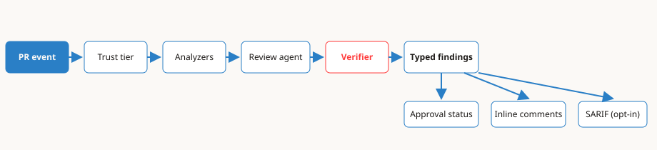

<div align="center">

<picture>
  <source media="(prefers-color-scheme: dark)" srcset="docs/assets/brand/mark-dark.svg">
  
</picture>

# mergeCraft

**AI-powered PR review as a standalone, [BYOK](docs/glossary.md#byok) GitHub Action.**
No SaaS account. No dashboard. Your repo, your keys, your reviewers.

[](https://github.com/alexhawat/mergeCraft/actions/workflows/ci.yml)
[](https://github.com/alexhawat/mergeCraft/actions/workflows/codeql.yml)
[](https://github.com/alexhawat/mergeCraft/actions/workflows/docker.yml)
[](LICENSE)
[](https://docs.astral.sh/uv/)

[**For LLM / Agents**](#for-agents) · [Quickstart](#quickstart) · [Problem](#problem) · [How it works in GitHub Action](#how-it-works) · [Features](#features) · [Docs](#docs)

[Agent skill](skills/mergecraft/SKILL.md) · [AGENTS-mergecraft.md](AGENTS-mergecraft.md) · [llms.txt](llms.txt)

</div>

---

<span id="for-agents"></span>

<details>
<summary><b>For LLM / Agents</b></summary>

### One-line setup prompts

Open your coding agent (its [harness](docs/glossary.md#harness)) in the repo you want reviewed and paste this. It installs
the CLI, runs `mergecraft init`, and stops at the credential step for you.

```text
Set up mergeCraft (BYOK AI PR review) in this repository.
Reference: https://github.com/alexhawat/mergeCraft/blob/main/AGENTS-mergecraft.md
Install uv if missing, then `uv tool install mergecraft-action==0.1.0a5`, run
`mergecraft init`, and print the `mergecraft provider auth <label> --scope github`
command for me to run. Never read, echo or commit a credential. After I confirm,
run `mergecraft doctor` (its `workflow auth` row must be ok; if not, `mergecraft
workflow sync --apply`), commit only the files `init` created, and open a PR.
```

The full prompts (install, teach your agent the mergeCraft skill, per-agent
one-liners) are in [`docs/agents.md`](docs/agents.md). Machine-readable entry points:
[`AGENTS-mergecraft.md`](AGENTS-mergecraft.md), [`llms.txt`](llms.txt),
[`skills/mergecraft/SKILL.md`](skills/mergecraft/SKILL.md), and the public MCP server
([`docs/mcp.md`](docs/mcp.md)).

MCP Registry ownership: `mcp-name: io.github.alexhawat/mergecraft`

</details>

## Quickstart

Five minutes, one repository, one provider credential.

<!-- BEGIN:requirements -->
**Requirements:** [uv](https://docs.astral.sh/uv/) is the only prerequisite for the
install; it downloads a compatible Python (3.11+) itself, so no system Python is
needed. The [GitHub CLI](https://cli.github.com) (`gh auth login`) is needed only
for `provider auth --scope github` (the default) or `--scope both`, which stores the secret
with `gh secret set`. `mergecraft init` needs neither `gh` nor a network;
`--scope local` needs no `gh`, but provider-specific authentication may need a network.
Two providers need one more CLI at the credential step: the Codex CLI for `openai`
and Claude Code for `anthropic`
([provider table](docs/authentication.md)).
<!-- END:requirements -->

1. **Install the CLI and scaffold the repo:**

```bash
uv tool install mergecraft-action==0.1.0a5
mergecraft init   # writes .mergecraft/config.yaml + .github/workflows/mergecraft.yml, no secrets
```

2. **Authenticate** a provider (subscription recommended — no metered API billing):

```bash
mergecraft provider auth opencode --scope github     # OpenCode Zen (recommended)
mergecraft provider auth opencode-go --scope github  # OpenCode Go subscription
mergecraft provider auth openai --scope github       # ChatGPT Plus/Pro/Team/Enterprise
mergecraft provider auth anthropic --scope github    # Claude Pro/Max
mergecraft provider auth google --scope github       # Google AI Studio
# or pick any configured label from: mergecraft provider list
```

The credential is stored as a GitHub Actions secret via `gh secret set`. Add
`--scope local` to write a local `.env` instead, for offline `mergecraft review`,
or `--scope both` for both.

3. **Check the setup:**

```bash
mergecraft doctor   # git, providers, analyzers, auth, config, workflow auth, MCP wiring
```

   `provider auth --scope github` (or `both`) also rewrites `.github/workflows/mergecraft.yml`
   so the workflow passes the secret it just stored. If the `workflow auth` row fails,
   run `mergecraft workflow sync --apply`.

4. **Commit and open a pull request.** Commit `.mergecraft/config.yaml`,
   `.github/workflows/mergecraft.yml`, the notes file under `.mergecraft/` and the
   `.gitignore` lines `init` added, then open a pull request (or run the workflow with
   `workflow_dispatch`). That pull request is the first review target; watch the
   `mergecraft-approval` check. The default scaffold does not listen for
   `@mergecraft review` comments.

Docs on `main` may describe unreleased behavior; the
[v0.1.0a5 docs](https://github.com/alexhawat/mergeCraft/tree/v0.1.0a5/docs) match
this install. Offline first: `mergecraft review --dry-run` prints the review prompt
with no credential. Something wrong? [`docs/troubleshooting.md`](docs/troubleshooting.md).

### Example 1 — auto-review every PR

```yaml
# .github/workflows/mergecraft.yml  — matches `mergecraft init` / examples/workflows/
name: mergeCraft
on:
  pull_request:
    types: [opened, ready_for_review, synchronize]
  workflow_dispatch:
    inputs:
      prompt:
        description: Prompt for the agent
        required: true
        type: string

permissions:
  contents: read   # a review needs only read access
  pull-requests: write
  issues: write
  checks: write
  actions: read

concurrency:
  group: mergecraft-${{ github.workflow }}-${{ github.event.pull_request.number || github.ref }}
  cancel-in-progress: true

jobs:
  mergecraft:
    runs-on: ubuntu-latest
    steps:
      - uses: actions/checkout@3d3c42e5aac5ba805825da76410c181273ba90b1 # v7.0.1
        with:
          persist-credentials: false
      - uses: alexhawat/mergeCraft@7080e962c2259757a34b9f745602f093e4ee3378 # v0.1.0a4
        with:
          prompt: >
            ${{ github.event_name == 'pull_request'
                && 'Review this pull request.'
                || github.event.inputs.prompt }}
          model: anthropic/claude-sonnet
          status_checks: enabled
        env:
          # Keep equal to the `uses:` commit above.
          MERGECRAFT_ACTION_SHA: 7080e962c2259757a34b9f745602f093e4ee3378
          CLAUDE_CODE_OAUTH_TOKEN: ${{ secrets.CLAUDE_CODE_OAUTH_TOKEN }}
```

More patterns — [ignore paths](docs/workflows.md#ignoring-paths), hardened `pull_request_target`, comment triggers, [SARIF](docs/glossary.md#sarif):
[`docs/workflows.md`](docs/workflows.md). Other install paths (Docker-only, no local
install): [`docs/install.md`](docs/install.md).

## Problem

Three reasons teams pick mergeCraft over hosted reviewers:

### Hosted SaaS → [BYOK](docs/glossary.md#byok)

Bring your own Claude Pro/Max or ChatGPT subscription, an API key, or any
OpenAI-compatible endpoint. Credentials and code stay inside GitHub Actions and
this repo's code — no proprietary backend. What it costs: [`docs/cost.md`](docs/cost.md).

### Vibes → evidence + [verifier](docs/glossary.md#verifier)

Deterministic [analyzers](docs/glossary.md#analyzer) settle mechanically checkable facts; the LLM only judges
what is left, and a second read-only verifier re-reads every Critical/Major
finding before it is published.

### Lock-in → MIT Action

One Docker action, one YAML workflow, MIT-licensed Python you can read end to end.

<span id="how-it-works"></span>

## How it works in GitHub Action

<picture>
  <source media="(prefers-color-scheme: dark)" srcset="docs/assets/diagrams/pipeline-dark.svg">
  
</picture>

A pull request event resolves a **[trust tier](docs/glossary.md#trust-tier)**, runs the matching **analyzers**,
then a **review agent** and a read-only **verifier** produce **[typed findings](docs/glossary.md#typed-finding)**
that drive inline comments, the `mergecraft-approval` check, and optional [SARIF](docs/glossary.md#sarif)
upload. Package map: [`docs/architecture.md`](docs/architecture.md); trust tiers and workflow
patterns: [`docs/workflows.md`](docs/workflows.md).

## How it works — CLI

`mergecraft review` runs the same analyzer + reviewer pipeline on a local diff, worktree
or patch file, with no pull request, and exits with a [named code](docs/EXIT-CODES.md).

```bash
mergecraft review --dry-run                      # offline, no credential: prints the review prompt
mergecraft review --agent --diff changes.patch   # orchestrator mode: JSONL on stdout
```

Runnable trees: [`examples/cli/`](examples/cli/), tour in [`docs/cli-examples.md`](docs/cli-examples.md).

## Features

| | |
|---|---|
| 🔍 **Deep PR review** | Correctness, risk, [blast radius](docs/glossary.md#blast-radius) and hygiene lenses; inline findings + narrative verdict |
| ✅ **[Structural approval gate](docs/glossary.md#structural-approval-gate)** | `mergecraft-approval` is a pure function of typed findings |
| 🛡️ **Trust tiers** | Fork PRs degrade to untrusted: no secrets, read-only analyzers; `mergecraft review` also works offline |
| 🤖 **Agent-native** | `--agent` JSONL protocol, contractual exit codes, MCP server, shipped skill + plugin |
| 🌐 **Opt-in extras** | SARIF upload, tracing ([`docs/TRACING.md`](docs/TRACING.md)), behaviour verification ([`docs/verify-behavior.md`](docs/verify-behavior.md)) |

## Authentication

Authenticate a provider with `mergecraft provider auth <label>`; every provider
mergeCraft ships a recipe for is below. Custom OpenAI-compatible endpoints, LiteLLM
proxies, multi-provider setups and model chains:
[`docs/authentication.md`](docs/authentication.md).

<details>
<summary><b>Provider table</b></summary>

<!-- BEGIN:provider-table -->
| Provider | Command | Needs | Secret stored | Recommended model (seeded) | Inferred harness |
|----------|---------|-------|---------------|----------------------------|------------------|
| Anthropic | `mergecraft provider auth anthropic` | Claude Code (`claude setup-token`) to mint the token | `LLM_PROVIDER_<N>_CLAUDE_CODE_OAUTH_TOKEN`; flat: `ANTHROPIC_API_KEY`, `CLAUDE_CODE_OAUTH_TOKEN` | `anthropic/claude-opus` | `claude` |
| Amazon Bedrock | `mergecraft provider auth bedrock` | cloud credentials (no `--api-key`) | `LLM_PROVIDER_<N>_AWS_ACCESS_KEY_ID` + `LLM_PROVIDER_<N>_AWS_SECRET_ACCESS_KEY`; flat: `AWS_BEARER_TOKEN_BEDROCK` | none — name a model explicitly | `opencode` |
| DeepSeek | `mergecraft provider auth deepseek` | an API key | `LLM_PROVIDER_<N>_API_KEY`; flat: `DEEPSEEK_API_KEY` | `deepseek/deepseek-pro` | `opencode` |
| Google | `mergecraft provider auth google` | an API key | `LLM_PROVIDER_<N>_API_KEY`; flat: `GEMINI_API_KEY`, `GOOGLE_GENERATIVE_AI_API_KEY` | `google/gemini-pro` | `gemini` |
| MiniMax (OpenAI-compatible) | `mergecraft provider auth minimax` | an API key | `LLM_PROVIDER_<N>_API_KEY`; flat: `MERGECRAFT_CUSTOM_PROVIDER_API_KEY` | `minimax/MiniMax-M3` | `opencode` |
| Moonshot AI | `mergecraft provider auth moonshotai` | an API key | `LLM_PROVIDER_<N>_API_KEY`; flat: `MOONSHOT_API_KEY` | `moonshotai/kimi-k2` | `opencode` |
| OpenAI | `mergecraft provider auth openai` | the Codex CLI on `PATH` (`npm i -g @openai/codex`; needs Node.js) | `LLM_PROVIDER_<N>_CODEX_AUTH_JSON`; flat: `OPENAI_API_KEY`, `CODEX_AUTH_JSON` | `openai/gpt` | `codex` |
| OpenCode | `mergecraft provider auth opencode` | a billing-backed key from [opencode.ai/auth](https://opencode.ai/auth) | `LLM_PROVIDER_<N>_OPENCODE_AUTH_JSON`; flat: `OPENCODE_API_KEY`, `OPENCODE_AUTH_JSON` | `opencode/big-pickle` | `opencode` |
| OpenCode Go | `mergecraft provider auth opencode-go` | an API key | `LLM_PROVIDER_<N>_API_KEY`; flat: `OPENCODE_GO_API_KEY` | `opencode-go/glm-5.1` | `opencode` |
| OpenRouter | `mergecraft provider auth openrouter` | an API key | `LLM_PROVIDER_<N>_API_KEY`; flat: `OPENROUTER_API_KEY` | `openrouter/claude-opus` | `opencode` |
| Paper Instruments | `mergecraft provider auth paperinstruments` | an API key | `LLM_PROVIDER_<N>_API_KEY`; flat: `MERGECRAFT_CUSTOM_PROVIDER_API_KEY` | `paperinstruments/ultramarine-1-flash` | `opencode` |
| Tencent TokenHub | `mergecraft provider auth tokenhub` | an API key | `LLM_PROVIDER_<N>_API_KEY`; flat: `TOKENHUB_API_KEY` | `tokenhub/hy3` | `opencode` |
| Google Vertex AI | `mergecraft provider auth vertex` | cloud credentials (no `--api-key`) | `LLM_PROVIDER_<N>_GOOGLE_APPLICATION_CREDENTIALS`; flat: `VERTEX_SERVICE_ACCOUNT_JSON` | none — name a model explicitly | `opencode` |
| xAI | `mergecraft provider auth xai` | an API key | `LLM_PROVIDER_<N>_API_KEY`; flat: `XAI_API_KEY` | `xai/grok` | `opencode` |

<!-- END:provider-table -->

Not in the provider catalog:

| Integration | Credential | Model |
|-------------|------------|-------|
| Cursor Cloud | `mergecraft auth cursor --scope github` (legacy shim) → `CURSOR_API_KEY` | `cursor/cloud-agent` |
| OpenAI-compatible (custom) | `MERGECRAFT_CUSTOM_PROVIDER_BASE_URL` + `MERGECRAFT_CUSTOM_PROVIDER_API_KEY` | `<your-prefix>/<your-model>` |
| Logfire tracing | `mergecraft auth logfire` — see [`docs/TRACING.md`](docs/TRACING.md) | — |

</details>

## Docs

| Doc | What it covers |
|-----|----------------|
| [`docs/install.md`](docs/install.md) | Action vs CLI vs Docker install paths |
| [`docs/authentication.md`](docs/authentication.md) | Providers, custom gateways, model fallback chains |
| [`docs/troubleshooting.md`](docs/troubleshooting.md) | Symptom-first fixes: no check, empty secret, exit codes |
| [`docs/upgrade.md`](docs/upgrade.md) | Move the CLI and the Action pin to a new release |
| [`docs/cost.md`](docs/cost.md) | What a review spends and which settings change it |
| [`docs/uninstall.md`](docs/uninstall.md) | Pause or remove mergeCraft |
| [`docs/architecture.md`](docs/architecture.md) | A run, end to end, mapped to `src/mergecraft/` |
| [`docs/glossary.md`](docs/glossary.md) · [`docs/workflows.md`](docs/workflows.md) · [`docs/agents.md`](docs/agents.md) | Terms, workflow patterns and trust tiers, agent prompts |
| [`docs/cli.md`](docs/cli.md) · [`docs/EXIT-CODES.md`](docs/EXIT-CODES.md) · [`docs/action-reference.md`](docs/action-reference.md) | Command reference, exit codes, every Action input |
| [`docs/REVIEW-CHECKS.md`](docs/REVIEW-CHECKS.md) · [`docs/ANALYZERS.md`](docs/ANALYZERS.md) · [`docs/trust-policy.md`](docs/trust-policy.md) | What a review checks, analyzers, operator trust knobs |
| [`SECURITY.md`](SECURITY.md) | Threat model, trust tiers, reporting |
| [`docs/`](docs/) | Full generated index |

## License

MIT — see [LICENSE](LICENSE). Contributing: [.github/CONTRIBUTING.md](.github/CONTRIBUTING.md).
