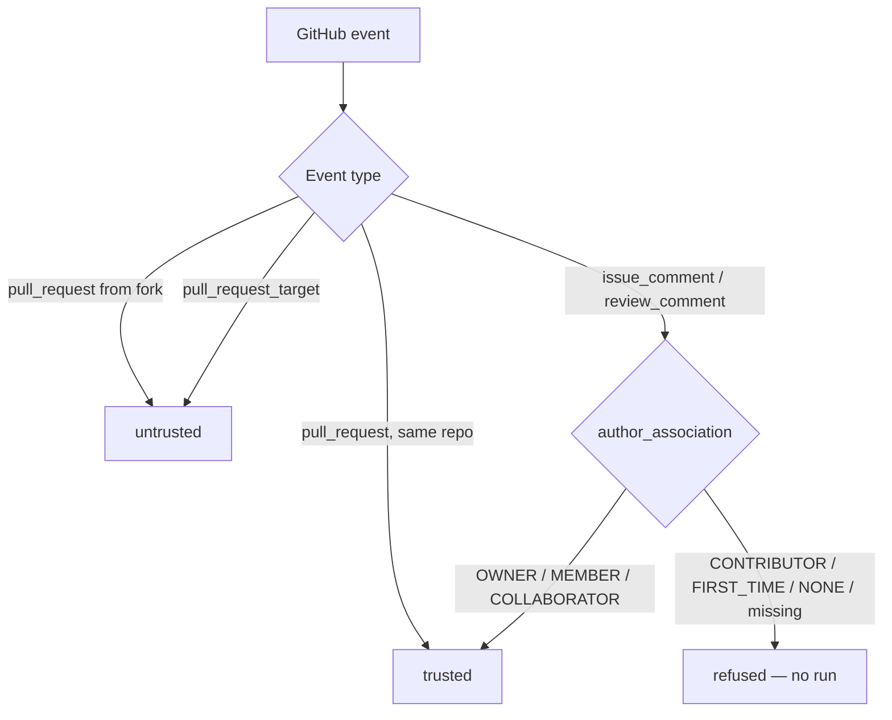

# Workflow examples and placement

Advanced workflow patterns, local review, and `pull_request_target` gotchas moved off the landing README.

<details>
<summary><b>Trust tiers & comment authorization</b> (click to expand)</summary>



The authorization decision reads `comment.author_association` from the event
payload — **never** the comment body — so writing `author_association: OWNER`
into a comment changes nothing. Details:
[Comment-trigger authorization](#comment-trigger-authorization).

</details>

## Comment-trigger authorization

Only `OWNER`, `MEMBER`, and `COLLABORATOR` may start a run from an
`issue_comment` or `pull_request_review_comment`. The gate reads
`comment.author_association` from the GitHub event payload — never the
comment body. Under `pull_request_target`, comment triggers also require
`allow_pr_target_comments: true` on the Action input (default off). See
[`allow_pr_target_comments`](action-reference.md) in the action reference.


### Example 2 — hardened, review as a required check

When the review gates merges, use `pull_request_target` with trust-aware
restrictions — [`examples/workflows/mergecraft-hardened.yml`](../examples/workflows/mergecraft-hardened.yml)
ships wait-for-CI, same-repo guards, and an enforce step that flips a `neutral`
approval check to blocking.

### Example 3 — local review before you push

```bash
mergecraft review                                        # uncommitted + branch changes vs origin/main
mergecraft review --base origin/main                     # this worktree vs that GitHub branch
mergecraft review --cwd ../feature-wt --base origin/main # linked worktree vs origin/main
mergecraft review --repo .                               # explicit local checkout
mergecraft review --repo owner/repo --head feature --base main   # public GitHub repo at a branch
mergecraft review --repo owner/repo --head pull/42/head --base main  # open or past GitHub PR
mergecraft review --repo https://github.com/o/r --token "$GH_TOKEN"  # private repo
mergecraft review --staged                               # staged changes only
mergecraft review --diff changes.patch --dry-run         # inspect the prompt, no LLM call
gh pr diff 42 > /tmp/pr-42.diff && mergecraft review --diff /tmp/pr-42.diff
mergecraft review --json findings.json                 # machine-readable Finding[] for scoring
mergecraft review --output-format sarif --output report.sarif.json
mergecraft review --output-format jsonl --output stream.jsonl
mergecraft review --agent                              # JSONL agent protocol on stdout
mergecraft review 2> review.md                         # human text is on stderr (D14)
```

Human-readable review text (default mode) is written to **stderr** so stdout stays free
for `--agent` JSONL and other machine payloads. Redirecting stdout (`mergecraft review > review.md`)
captures nothing useful — use `2>` instead (`mergecraft review 2> review.md`). Structured
findings still go to `--json` / `--output` paths as documented above. Root `--format json`
selects JSON output when `--output-format` is omitted (same pattern as `findings export`).

Process exit codes: `0` clean pass; `10` non-blocking findings; `11` blocking severities;
`12` review failed (no findings); `20` inconclusive; `30` configuration error; `40` infra error;
`50` timed out; `2` usage / invalid CLI input. Full table: [`docs/EXIT-CODES.md`](EXIT-CODES.md).

`diff-review` remains a hidden deprecated alias of `review` (one stderr warning per invocation).

**Auth precedence for private clones:** `--token` → `GH_TOKEN` / `GITHUB_TOKEN` →
`gh auth token` → anonymous (public repos only). Cloned third-party repositories
review at **untrusted** tier unless you pass an explicit `--trust trusted` override.

### Example 4 — multi-model with fallback

```yaml
# .mergecraft/config.yaml
models:
  - anthropic/claude-sonnet
  - openai/gpt-5.3-codex
  - google/gemini-3.1-pro-preview
modelFallbacks:
  anthropic/claude-sonnet:
    - anthropic/claude-opus
push: restricted
shell: restricted
staticChecks:
  - name: lint
    command: make lint
```

Add `model: <slug>` to the workflow `with:` block to pick the **head** of
the chain (default chain head is the first `models:` entry); the configured
fallbacks are walked on credential miss or retryable failure. See
[Chain semantics in authentication.md](authentication.md#chain-semantics--model-37--w4) for the contract.

### Example 5 — SARIF upload to code scanning (opt-in)

Publish analyzer findings as GitHub code-scanning alerts — off by default,
requires `security-events: write`:

```yaml
permissions:
  contents: read
  pull-requests: write
  security-events: write   # required — without it GitHub answers 403

jobs:
  review:
    steps:
      - uses: alexhawat/mergeCraft@v0.1.0a1
        with:
          sarif_upload: enabled
```

Only findings admitted by the run's trust tier, `shell:` policy and
`analyzers:` mode are uploaded, after secret redaction — agent narrative is
never uploaded. Details: [docs/ANALYZERS.md](ANALYZERS.md).

Full config reference: [`examples/config.yaml`](../examples/config.yaml).

### Example 6 — Tracing with Logfire (opt-in)

Every run can emit a per-request span tree — to local JSONL, to
[Logfire](https://logfire.pydantic.dev/), or to any OTLP collector — off by
default:

```yaml
- uses: alexhawat/mergeCraft@v0.1.0a1
  with:
    tracing: enabled
    tracing-to: logfire
  env:
    LOGFIRE_TOKEN: ${{ secrets.LOGFIRE_TOKEN }}
```

One `trace_id` groups every span from a run into a single tree, so a
Logfire trace view of a real review reads top to bottom as:

```
mergecraft.run
└── agent.attempt          (per fallback entry: model.id, status, ...)
    ├── provider.call      (once per upstream API request)
    │   ├── http.client.request
    │   └── llm.call       (model.id, cost.*, gen_ai.usage.*)
    └── tool.call           (tool.name, tool.server)
```

`gen_ai.*` attrs on `llm.call` / `provider.call` follow the GenAI
semantic-convention keys, so Logfire's built-in AI panels group and render
them without extra config. Full config schema, the redaction guarantee, and
the payload/span-count caps: [docs/TRACING.md](TRACING.md).

<!-- Asset pending: a screenshot of this trace tree for a real review,
committed under assets/ and linked here — operator-captured, see the
issues-showcase-readiness wave plan (PR G5 / D7). -->

<span id="security-model"></span>

## 🔒 Security model

- **BYOK by design** — credentials and repo content never leave GitHub
  Actions / your machine and this repo's code.
- **Comment triggers are authorized, not authenticated-by-content** — only
  `OWNER`/`MEMBER`/`COLLABORATOR` associations can invoke; the body is never
  consulted. Two opt-in knobs (`allow_pr_target_comments`,
  `commentInvocationAllowlist`) each widen exactly one axis.
- **Learnings are fail-closed** — entries land in `## Staging`; only
  maintainer-associated authors promote to `## Active`, and active entries are
  nonce-fenced before the model reads them.
- **The approval check is structural** — `success` requires a completed trusted
  run with no Critical/Major findings; `failure` on any blocker; `neutral` for
  crashes, timeouts, and untrusted tiers. The agent's narrative approval is
  advisory only.
- **Analyzers under low trust run untrusted-only** — no secrets, no network, no
  PR-authored command construction; exclusions are reported as named skips.
- **Agent subprocess env is an explicit allowlist** — agent CLIs never
  inherit the full process environment. Stripped by default: ``GIT_ASKPASS``,
  ``GITHUB_TOKEN``/``GH_TOKEN``, ``ACTIONS_ID_TOKEN_*``, and every non-active
  provider API key. Git authentication for agent operations is brokered
  per-invocation via MCP git's ``http.extraHeader`` injection, not ambient
  askpass. Retained askpass files (entrypoint bookkeeping only) live at
  ``0o600`` inside a ``0o700`` credentials directory the agent cannot read.
  Run temp dirs and registered leak-surface paths are removed on success and
  failure; ``wipe_runner_leak_surface`` only unlinks mergeCraft-owned paths.
- **`push` / `shell` value semantics are defined in the action-inputs
  table** — see [Action inputs (`with:`) in action-reference.md](action-reference.md#action-inputs-with)
  for the `disabled` / `restricted` / `enabled` vocabulary both inputs share.
- **Containment hardening** — ``safe.directory`` is scoped to
  ``$GITHUB_WORKSPACE`` and registered cross-repo checkout roots (no wildcard).
  Git hooks run only when ``shell: enabled``; ``restricted`` and ``disabled``
  neutralize hooks via ``core.hooksPath``. ``cwd`` and MCP shell
  ``working_directory`` must resolve inside allowed workspace roots. Agent CLI
  subprocesses drop to the unprivileged ``mergecraft`` user via ``setpriv``
  while the action entrypoint stays root for GitHub file commands.
- **Network is outside the hard sandbox guarantee when ``unshare --net`` is
  unavailable (W12.7)** — on CI hosts that support it, untrusted MCP shell
  spawns with ``unshare --pid --net`` so the child has an empty network
  namespace. Where that probe fails (macOS runners, restricted containers,
  missing CAP_SYS_ADMIN), shell egress is not kernel-isolated; the W2
  credential allowlist (no ambient ``GITHUB_TOKEN`` / provider keys / askpass)
  remains the binding control. Trusted-tier shell does not force ``--net`` so
  provider CLIs can still reach their APIs.

Report vulnerabilities via [SECURITY.md](../SECURITY.md). What a review does and
never does: [REVIEW-CHECKS.md](../REVIEW-CHECKS.md).

## ⚙️ Workflow-placement gotchas (`pull_request_target`)

GitHub resolves `pull_request_target` workflows from the **default branch** —
the workflow file *and* the checked-out commit, whatever base the PR targets
([Nov 2025 policy](https://github.blog/changelog/2025-11-07-actions-pull_request_target-and-environment-branch-protections-changes/),
effective 2025-12-08). Three consequences:

- **A copy on a non-default trunk is inert.** If `main` is a stub and real work
  lands on a staging branch, this workflow still has to live on `main`.
- **`GITHUB_REF` / `GITHUB_SHA` point at the default branch**, not the PR base —
  so a bare `actions/checkout` lands on default-branch tip and
  `.mergecraft/config.yaml` is read from there. Environment branch-protection
  rules also now evaluate against the default branch; update environment
  filters if you gate secrets that way.
- **A PR that edits this workflow is still reviewed — by the default-branch
  copy.** Its own edits apply to the *next* PR, after merge. (That much was
  always true of `pull_request_target`; what Nov 2025 changed is base branch →
  default branch.)

If the review is **not** a required check, prefer plain `pull_request` — simpler,
and no secrets in scope. The case for accepting `pull_request_target` is narrower
than it looks: GitHub cannot build `refs/pull/N/merge` for a conflicted PR, so
`pull_request` runs are skipped and a *required* review check sits unreported
for as long as the conflict lasts. `pull_request_target` still fires on
`synchronize` in that state, so the review lands — and its verdict is visible —
while the PR is still conflicted.

That is the whole of the benefit, and it is worth stating plainly: pushing the
conflict fix to the PR branch fires `synchronize` and clears a `pull_request`
check too, so the gap is the conflicted window, not a permanent block. It
outlasts the conflict only when the conflict disappears *without* a push to the
head branch — the base moved, say — because nothing then re-triggers the run.
A conflicted PR is unmergeable on its own account anyway, so weigh this against
running with secrets in scope rather than treating it as decisive.

If you pin the action SHA in more than one place, gate the copies against each
other in CI — and read the workflow side from the **default branch**
(`git show origin/main:.github/workflows/mergecraft.yml`), not the working tree.
Bump order is default branch first, local pin second.

Since [June 2026](https://github.blog/changelog/2026-06-18-safer-pull_request_target-defaults-for-github-actions-checkout/)
`actions/checkout` refuses to check out fork PR code under `pull_request_target`
unless you pass `allow-unsafe-pr-checkout` (v7 GA 2026-06-18, backported to all
supported majors 2026-07-20). mergeCraft's shipped workflows are unaffected —
they check out the default branch with no `ref:` and reach PR content through
`checkout_pr` and the API, never by executing PR-authored code with secrets in
scope.

Full rationale in the collapsible sections of
[documentation index](README.md).
