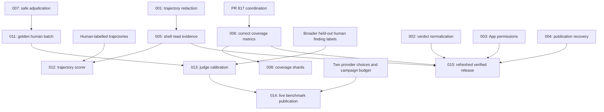

# mergeCraft issue audit and implementation plan

Audited on **2026-09-22** using current GitHub main **`be9993367386b03f982c795ceb1d80e4a0bfcf1d`** and PR #817 head **`d72b4e77dd47d7937527837b3f653a858804cf4e`**. Generated with the improve skill and independently reviewed by three faster subagents. This PR publishes the audit and implementation handoff. It does not implement the fixes, close existing issues, merge other PRs, or approve a release.

The audit used immutable main source, preserving the original checkout and its pre-existing configuration change. This plan branch starts from the audited main revision in a separate worktree. Implementation branches must start from updated main and pass each plan's drift check. See [EXECUTION.md](EXECUTION.md) for work allocation, integration gates, and the exact meaning of completion.

## What PR #817 closes

[PR #817](https://github.com/alexhawat/mergeCraft/pull/817) is **open and unmerged** at this audit. Its body and GitHub `closingIssuesReferences` contain **only [#771](https://github.com/alexhawat/mergeCraft/issues/771)**. It changes the coverage-floor script and CHANGELOG.

It also satisfies the remaining numeric request in **[#797](https://github.com/alexhawat/mergeCraft/issues/797)** once merged: the behavioral tests already exist on main, while the old token floor remains 51.9/39.2. #817 raises it to 90.7/86.2. **#797 will not auto-close**, because it is not linked with a closing reference.

**Important review finding:** the pre-existing coverage algorithm defect now filed as **[#824](https://github.com/alexhawat/mergeCraft/issues/824)** remains in #817. Module “line” percentages read coverage.py's combined line+branch percentage. A reproduced 90% line / 100% branch module incorrectly passes both main's 91.5% and #817's 92% line floor. This is **not introduced by #817**, but it undermines the stated line-protection guarantee. Resolve [plan 006](006-coverage-metric-contract.md) before relying on that baseline as proof; coordinate whether #817 is amended or followed immediately by an explicit corrective measurement.

## Every originally open issue

All **14** open issues were read, including comments. These dispositions distinguish implemented work, remaining code, and human/operator input.

| Issue | Relevance on audited main | Action / completion owner |
|---|---|---|
| [#771](https://github.com/alexhawat/mergeCraft/issues/771) coverage honesty | Test-suite separation landed; numeric rebaseline is in #817. | Close through #817 on merge, while keeping #824 tracked until metric semantics are fixed. |
| [#797](https://github.com/alexhawat/mergeCraft/issues/797) token critical-path coverage | Requested behavioral suite exists; only stated floor replacement remains. | After #817/006, verify the final true line/branch floor and close manually; no duplicate test wave. App permission correctness is separately #821. |
| [#796](https://github.com/alexhawat/mergeCraft/issues/796) bogus modified paths | **Resolved** by #806: modified paths now come only from the run diff; git ranges/object reads are handled. Regression tests pass. | Close with #806 evidence. New read-side issue #823 is distinct. |
| [#790](https://github.com/alexhawat/mergeCraft/issues/790) missing example Action pins | **Resolved** by #806: examples/templates export the same ref they run; README dispatch and pin tests exist and pass. | Close with #806 evidence. Do not wait for #817 or duplicate the port. |
| [#792](https://github.com/alexhawat/mergeCraft/issues/792) nonexistent comment trigger | Core trigger claim fixed in #806 in all ten skills. Both AGENTS commit-only lists still omit learnings/ignore changes. | Finish the small residual [plan 010](010-setup-instructions.md), regenerate llms, then close. |
| [#785](https://github.com/alexhawat/mergeCraft/issues/785) local coverage sharding | **Still valid**: coverage ignores split/worker flags and deletes shared data; no complete-set combine gate. | [Plan 008](008-coverage-shards.md), after metric semantics are corrected. |
| [#779](https://github.com/alexhawat/mergeCraft/issues/779) adjudication corruption | **Still valid and reproduced**: object becomes list, then strict schema rejects provenance/adjudication even when unwrapped. | [Plan 007](007-adjudication-roundtrip.md). Current loader is cwd-first, so update that stale detail in the issue. |
| [#780](https://github.com/alexhawat/mergeCraft/issues/780) golden human adjudication | **Still needed**. Nine metadata rows lack adjudication and inspectable patch/source evidence. | [Plan 011](011-human-golden-batch.md): prepare evidence, then Alex confirms/corrects. Nine cases span eight categories; no fabricated human labels. |
| [#735](https://github.com/alexhawat/mergeCraft/issues/735) trajectory scoring | **Still needed**, but not a request to rebuild the auditor. | [Plan 012](012-trajectory-scoring.md): deterministic scoring plus separately human-labelled trajectories. #780's golden findings are not trajectory labels. |
| [#736](https://github.com/alexhawat/mergeCraft/issues/736) judge calibration | **Still needed**: provenance eligibility exists; held-out judge evaluation does not. Current CLI can overcall eligibility “calibrated.” | [Plan 013](013-judge-calibration.md): reporting correction, paired decisions, disjoint held-out dataset and validated thresholds. |
| [#140](https://github.com/alexhawat/mergeCraft/issues/140) published benchmarks | **Still needed**. No accepted live-quality publication. The old eval-replay procedure is now structural only. | [Plan 014](014-live-benchmark-publication.md): frozen patch-bearing independent corpus, two chosen providers via bench-detect, budget and actual results. |
| [#723](https://github.com/alexhawat/mergeCraft/issues/723) reliability roadmap | **Keep as tracker**, not another implementation project. Structural CI/release gates and children #737–#740 are already shipped/closed. | Refresh body: #780 exists; #735 needs distinct trajectory labels; #736 needs held-out finding labels; #140 owns publication. Close only after remaining children are completed or explicitly deferred. |
| [#798](https://github.com/alexhawat/mergeCraft/issues/798) eight tracing xfails | **Partially relevant; rewrite scope.** Analyzer spans, per-attempt usage and real trace-ID propagation already exist. Some old tests were invalid. | [Plan 009](009-tracing-contracts.md): valid behavioral coverage plus complete lifecycle root ownership. Retire obsolete runnable-index/two-successful-attempt expectations. |
| [#783](https://github.com/alexhawat/mergeCraft/issues/783) 0.1.0a2 publication | **Relevant operator work, stale candidate**. Old release branch is f98db2a5; Full verify failed; six targets unchecked and issue unaccepted. | [Plan 015](015-release-candidate.md): refresh candidate after fixes, verify provenance/soak, then explicit publish approval. Do not accept the old issue automatically. |

No original issue was closed or rewritten during this planning audit. The table records the recommended housekeeping actions and avoids silently changing existing issue scope.

## New issues filed

All six are high-confidence, independently vetted against the source, and have reproducible failure paths. Evidence uses fabricated inputs or mocked APIs; no real credentials or GitHub reviews were used.

| Issue / finding | Priority | Effort | Fix risk | Evidence / plan |
|---|---|---|---|---|
| [#819](https://github.com/alexhawat/mergeCraft/issues/819) raw path fields bypass secret redaction | P1 | S–M | Medium | [trajectory:520–521](https://github.com/alexhawat/mergeCraft/blob/be9993367386b03f982c795ceb1d80e4a0bfcf1d/src/mergecraft/evidence/trajectory.py#L520); [001](001-trajectory-redaction.md) |
| [#820](https://github.com/alexhawat/mergeCraft/issues/820) downgraded typo still forces request changes | P1 | M | Medium | [verdict:943](https://github.com/alexhawat/mergeCraft/blob/be9993367386b03f982c795ceb1d80e4a0bfcf1d/src/mergecraft/mcp/verdict.py#L943); [002](002-normalized-terminal-verdict.md) |
| [#821](https://github.com/alexhawat/mergeCraft/issues/821) minted App token lacks reviewer API grants | P1 | M | High | [token:192](https://github.com/alexhawat/mergeCraft/blob/be9993367386b03f982c795ceb1d80e4a0bfcf1d/src/mergecraft/utils/token.py#L192); [003](003-app-reviewer-permissions.md) |
| [#822](https://github.com/alexhawat/mergeCraft/issues/822) successful publication retry remains unpublished | P2 | S | Low–medium | [review:1159](https://github.com/alexhawat/mergeCraft/blob/be9993367386b03f982c795ceb1d80e4a0bfcf1d/src/mergecraft/mcp/review.py#L1159); [004](004-publication-retry-state.md) |
| [#823](https://github.com/alexhawat/mergeCraft/issues/823) normal shell reads produce false unread-file findings | P2 | M | Medium | [trajectory:375](https://github.com/alexhawat/mergeCraft/blob/be9993367386b03f982c795ceb1d80e4a0bfcf1d/src/mergecraft/evidence/trajectory.py#L375); [005](005-shell-read-evidence.md) |
| [#824](https://github.com/alexhawat/mergeCraft/issues/824) branch coverage masks module line regressions | P1 | S–M | Medium | [coverage gate:116](https://github.com/alexhawat/mergeCraft/blob/be9993367386b03f982c795ceb1d80e4a0bfcf1d/scripts/check_coverage_floors.py#L116); [006](006-coverage-metric-contract.md) |

Issue bodies are preserved under [issues/](issues/) as the original filing record. The numbered plans in this PR are the implementation handoff; later plan refinements may be more specific than the filed issue bodies.

## Execution order and status

The recommended first batch is **001, 002, 003, 006 and 007**. They protect secrets, verdict correctness, authentication, the verification gate and the human-label prerequisite. Independent work can run in parallel; coordinate files shared by 001/005, 002/004 and 003/009.

| Plan | Deliverable | Priority | Dependency | Status |
|---|---|---|---|---|
| [001](001-trajectory-redaction.md) | Redact every trajectory persistence route | P1 | — | TODO |
| [002](002-normalized-terminal-verdict.md) | Finalized findings determine enforced verdict | P1 | — | TODO |
| [003](003-app-reviewer-permissions.md) | Git/App reviewer permissions by purpose | P1 | — | TODO |
| [004](004-publication-retry-state.md) | Correct recovered-publication status | P2 | coordinate 002 | TODO |
| [005](005-shell-read-evidence.md) | Accurate shell read attribution | P2 | 001 | TODO |
| [006](006-coverage-metric-contract.md) | Real line floors and honest metric names | P1 | coordinate #817 | TODO |
| [007](007-adjudication-roundtrip.md) | Safe typed adjudication round-trip | P1 | — | TODO |
| [008](008-coverage-shards.md) | Isolated coverage shards + complete-data gate | P2 | 006 | TODO |
| [009](009-tracing-contracts.md) | Valid tracing contracts and whole-run parent tree | P2 | coordinate 003 | TODO |
| [010](010-setup-instructions.md) | Finish setup artifact lists | P3 | — | TODO |
| [011](011-human-golden-batch.md) | Evidence packet + nine actual human decisions | P2 | 007 | TODO preparation; human decisions pending |
| [012](012-trajectory-scoring.md) | Per-check trajectory scoring and labelled baseline | P2 | 001/005 before baseline; separate human trajectories | TODO scorer; human-labelled enforcement pending |
| [013](013-judge-calibration.md) | Eligibility vs held-out judge calibration | P2 | 007/011 plus broader held-out dataset | TODO reporting; held-out validation pending |
| [014](014-live-benchmark-publication.md) | Two-provider live detection report | P2 | 013; separate detection labels, model choices and spend ceiling | TODO campaign preparation; live run pending |
| [015](015-release-candidate.md) | Verified refreshed release and deployment identity | P2 | selected technical fixes 001–010 | TODO candidate preparation; publication separate |

Release may remain honestly uncalibrated while human-data work continues. Do not create an artificial requirement to fabricate or rush evaluation results for an alpha release; do not claim those results until they exist.

The evaluation work uses four distinct artifacts: golden-case evidence and decisions (011), labelled tool trajectories (012), paired judge/human finding decisions (013), and patch-bearing detection baselines (014). Completing one does not supply another automatically; reuse requires an explicit evidence mapping and the corresponding human judgement.

## Architecture and constraints the plans preserve

- **Entrypoints:** the Docker Action/gha CLI converges on main.py; local review uses offline_review.py. Context/trust/config assembly precedes reviewer execution.
- **Review decisions:** analyzers/static checks and reviewer drafts feed normalization, verifier and structured terminal submission. agents/gates.py owns structural blockers; MCP validates scope and publishes a bound review. A precision-stage result must reach both gate and publication coherently.
- **Evidence:** run_packet combines findings, trajectory and run health. Change-scoped findings may block; run-scoped trajectory findings are advisory. Evidence serialization is a security boundary.
- **Providers:** registry/model-chain dispatch and TokenRef credential management separate configured intent from executed authority. Preserve least privilege, repo scoping, fallback diagnostics and revocation.
- **Evaluation:** structural replay, live detection, provenance eligibility, human adjudication and validated calibration answer different questions. Reuse the shipped machinery and identify each dataset/claim precisely.
- **Delivery:** code merge, built source, signed digest, Action manifest and consumer pin are separate steps. Every production fix needs the normal verified image/pin cycle.
- **Tooling:** Python 3.11+, uv, Make commands, strict mypy/Pyright, Ruff/loguru, generated docs/examples/skills, keyless unit CI and explicitly bounded live integration. Do not weaken fail-closed trust or security controls.

## Verification and limitations

See [VERIFICATION.md](VERIFICATION.md) for exact scope and results. **85 selected/probe tests passed, 2 optional OTel tests skipped**, plus direct deterministic reproductions for redaction, path attribution, adjudication, verdict ordering and coverage arithmetic. Three passing probe tests intentionally assert existing defects; they are evidence of the bugs, not fixes.

No full make ci, new whole-suite coverage measurement, live provider campaign, Docker build/scan or release was run during the audit. Review of security/runtime code is hotspot-weighted, not a proof that every analyzer or boundary is bug-free.

## Considered and rejected or deferred

- Reimplement #790/#796: rejected; code and targeted regressions show these are already fixed in #806.
- Add another token coverage wave for #797: rejected; current behavioral tests exist, #817 supplies its stated floor change. New permission correctness and metric semantics are tracked separately.
- Restore #798's eight xfails verbatim: rejected. Some referenced nonexistent models/fixtures, expected a skip they never simulated, or expected a chain to run after success. Preserve intended useful contracts, not broken tests.
- Require a second human to compute judge–human kappa: rejected as a blanket claim. It requires paired ratings; two humans are needed for human–human inter-rater reliability. Neither statistic alone validates a threshold or repairs missing held-out data.
- Rebuild trajectory/shadow/eval infrastructure: rejected; much is already shipped. The remaining work is accurate observations, scoring, data and validation.
- Call provenance eligibility calibrated: rejected; fixed within #736's plan rather than creating a duplicate issue.
- Analyzers-image build-source stamping: source-level concern only; no image smoke was run. Investigate under release smoke verification before filing another bug.
- Broad refactors, dependency migrations and new product features: no speculative roadmap added. Correctness, existing issue completion and reliable release evidence take precedence.

Each implementation owner should update this index after real verification. Keep recommendations to close/defer issues distinct from actual GitHub state changes.
